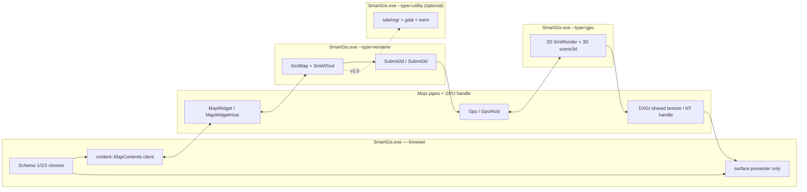
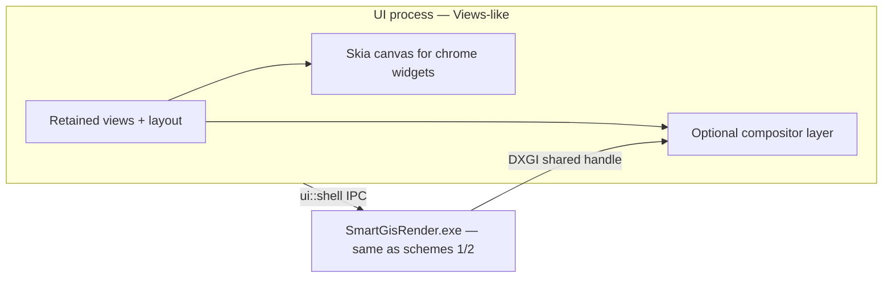
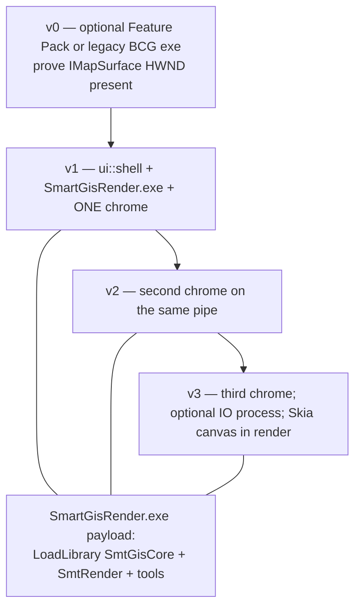

<!--
Copyright (c) 2026 The Mogu Authors.
All rights reserved.
-->

# Interchangeable UI shells + out-of-process map renderer

三种可替换桌面 chrome（WebView2 / WinUI 3 / Chromium Views-like），共用同一套 **host ABI** 和 **多进程地图渲染**。第 0 节底物已落地（`src/content` + `src/gpu`）；第 1–3 节仍是方案论文，不是实现计划。不引入 Qt。

当前产品事实（以树为准，不是 2010 路径）：

- 工程入口只有 GN/`build.bat`，产物只在仓库根 `out/`。`//src:src_all` 是 31 个非 MFC DLL。`//:smartgis`（`build.bat app`）才出 `out/SmartGis.exe`。
- 产品在 `src/`：`app/`、`app/app_core`、`ui/{gui,mfc_ex,xview,xcatalog,xambox}`、`render/{gdi,gdi_simple,gl,render3d}`（D3D9 树已删；leftover 亦见 `legacy/render/`）、`gis/`、`sdb/datasource/{mgr,gdal,mem}`（`smf` / `ws` 已移除）、`map/`、`plugin/` + AM 子模块、`tool/`（终局 dispatch）+ `legacy/tool/` / `legacy/tool/group`（leftover IATool）。
- 遗留 ABI 保留：`Smt_*` 命名空间、`Export_Smt*`、磁盘 DLL stem（`SmtGisCore`、`SmtRender`、`SmtGLRenderDevice`、`SmtXViewCore` …）。新公共命名空间最多两层。
- 今日桌面是 **MFC + BCGControlBar Pro**（`CBCGPMDIFrameWnd`、dock catalog、AM toolbox）。机器上可以没有 BCG；**不要盗版 BCG**。MFC Feature Pack（`CMFC*`）只允许作为可选 bootstrap exe，**不是本文的上限**。
- 今日地图视图是进程内 HWND：`SmtXView`（`CView`）→ `SmtRenderDevice::Init(HWND)`。交互工具是 `SmtIATool`（`Smt_IATool`），插件是 `SmtAuxModule`（`Smt_AM`）。地图文档是 `Smt_GIS::SmtMap`。
- **禁止 Qt**（Widgets / Quick / QML / Network / Qt5/Qt6）。Skia 只当 canvas/render backend。
- 未来渲染器不围绕 D3DX9。允许：现有 GL、未来 Skia canvas、可选 DXGI/D3D11+。

对照：分层树见 [`src-layout.md`](src-layout.md)；工程入口见 [`../README.md`](../README.md)。

---

## 0. Shared substrate（真正的上限）

**Status (2026-09-14):** Substrate in tree (`src/content`, `src/gpu`, repo-root `base/ipc`). Destination: one PE `out/SmartGis.exe` relaunched via `content::ContentMain` and `--type=browser|renderer|gpu|utility` (no `SmartGisRender.exe` on the product path). Browser starts **renderer and standalone GPU** children always. **Chromium Mojo pin abandoned.** Product transport is Win32 named pipe + BinarySink payloads（`base/archive`，`base::`；C++ structs with `archive()`）；RPC/包络侧 `net::Pickle` 仍在 `src/net/pack/pickle.h`。Children still get `--pipe=` until a later invitation task; no Mojo invitation. Sections 1–3 below are unchanged design essays.

三种 chrome 的上限不在控件库，而在：**chrome 可拔插 + 地图渲染可崩溃可重启 + 现有 31 个 DLL 在 v1 不必改 ABI**。

### 0.1 目标与非目标

**目标**

- 一个 **UI/chrome 进程**（方案 1/2/3 可替换）+ 一个 **Render/GPU 进程**（三种方案共用）。
- 可选 **IO/SDE 进程**：GDAL / 网络。栅格驱动或数据库崩了，不带走 catalog chrome。
- Chrome **禁止**直接 `#include` `gis_map.h` / `rd_renderdevice.h` / `t_iatool.h`。只走 host ABI。
- v1 渲染进程内 `LoadLibrary` 现有 `Smt*D.dll`，用适配器包一层；不重写 `Smt_*`。
- 多视图 / 多窗口：默认 **一个 render 进程、N 个 surface**。
- 同一 render 进程可被未来 headless map server 复用（对齐已有 `map/service` 的服务端渲染，而不是再写一套瓦片管线）。

**非目标**

- 不引入 Qt。
- 不盗版 BCG，不“假 MFC”重画 2010 皮肤。
- Feature Pack 不是终态；只允许 v0 可选 bootstrap。
- 不把 D3DX9 设计成未来 GPU 路径（`src/render/d3d` 已删除）。
- 不把整个 Chromium 源码树搬进本仓（方案 3 见第 3 节）。
- v1 不重写 `Smt_*` 命名空间，不合并 DLL，不改 `dll_stem`。
- 不做完整 Chromium sandbox（Job + 完整性级别即可）。

### 0.2 进程模型（默认）

**单二进制：** 产品只有 **`out/SmartGis.exe`**（或启动它的 chrome 变体 exe）。`wWinMain` → `content::ContentMain` 按 `--type=` 分派；子进程 **重新启动同一 PE**，不是第二套映像名。`GetModuleFileNameW` + `CreateProcess` 复制浏览器命令行，追加 `--type=renderer` 或 `--type=gpu` 与 `--mojo-platform-channel-handle=`。`--in-process-gpu` 默认 **关**（仅 debug / CI）。

| 进程 | 启动方式 | 职责 | 允许加载的现有 DLL（v1） | 禁止 |
| --- | --- | --- | --- | --- |
| **Browser / UI** | `SmartGis.exe`（省略 `--type` 或 `--type=browser`；方案切换时可用 `SmartGisWinui.exe` / `SmartGisViews.exe` 并行装） | 窗口、ribbon/tree/property/dialog、**仅 present** 共享表面、把输入经 host 转给 renderer | 仅 chrome + `content` 客户端 + 方案专用 UI。**不** Load `SmtGisCore` / `SmtSDEGdalDevice` | GDAL 连接串 / 数据集、`SmtRenderDevice::Init`、GL/D3D11 设备 |
| **Renderer** | **同一 PE** `SmartGis.exe --type=renderer` | `SmtMap` / `SmtIATool`、pick/hit-test、工具与 catalog 逻辑（CPU）；`Submit2d` / `Submit3d` 到 GPU | `SmtCore`、`SmtSysCore`、`SmtBaseLib`、`SmtGeoCore`、`SmtGisCore`、`SmtGisPrj`、`SmtToolCore`、`SmtGroupToolCore`、`SmtAuxModule` + 各 `SmtAM*`（UI-less 部分） | MFC `CView`、BCG dock、WebView2、WinUI 控件、**任何** GL/D3D11 设备 |
| **GPU**（**必需**独立子进程） | **同一 PE** `SmartGis.exe --type=gpu` | **全部 2D 与 3D 绘制**：`kMapEdit` / `kMapData`（`SmtRender` + GL/GDI）与 `kScene3d`（`render3d` + `scene3d` / `terrain` / `pointcloud`）；共享 DXGI 句柄 + `FrameReady` | `SmtRender`、`SmtGLRenderDevice`、`SmtGdiRenderDevice`、`SmtGdiSimpleRenderDevice`、`Smt3DRenderer`、`scene3d` / `model3d` / `terrain` / `pointcloud` | 可见 chrome HWND、WebView2、WinUI、`SmtIATool` 输入路由 |
| **Utility / IO**（可选，v1.5） | **同一 PE** `SmartGis.exe --type=utility` | `sde/gdal`、`net`、目录枚举 | `SmtSDEDeviceMgr`、`SmtSDEGdalDevice`、`SmtSDEMemDevice`、`SmtNetCore`、`SmtMapService`（服务端读） | HWND、GPU 设备、chrome |

**没有 `SmartGisRender.exe` 作为产品 GPU 映像。** 今日 `//src/gpu:gpu` / `build.bat render` 的独立 console exe 是过渡；终局是 `--type=gpu` 入口链进同一 `executable("smartgis")`。

**默认拓扑：1 Browser + 1 Renderer + 1 GPU**（Chromium Windows：两个子进程始终存在）。IO 进程在第一次把 GDAL 从 renderer 拆出时再开（`--type=utility`）。v1 允许 SDE DLL 先住在 renderer 里。

**为什么要多进程**

- GPU 驱动 / GL context 崩了，chrome 和未保存工程元数据还在；**仅 GPU 子进程**可重启并重挂 surface（renderer 可保持）。
- 插件（`SmtAuxModule`）和 GDAL 驱动与 UI 隔离。
- 4K / 多显示器 / 多文档：N 个 surface 共享 **一个 GPU 进程内** 的 GL/D3D11 设备（2D 与 3D 视图可混在同一 GPU 进程）。
- `map/service`（`SmtMapService`）已是“无 MFC 的地图绘制 + 瓦片缓存”。Renderer 是同一 payload 的交互版；headless 模式只是不创建 presentable surface。



父进程用 Job Object 管子进程：Browser 退出则杀子进程；**renderer 崩溃** → `RendererDied` → 重启 `--type=renderer`（GPU 可仍在）；**GPU 崩溃 / TDR** → 仅重启 `--type=gpu`，browser 丢弃旧 handle 并等待新 `FrameReady`。

### 0.3 建议的 GN 落点（只设计，不接线）

遵守 `src/<layer>/<module>` 两层上限（与 [`src-layout.md`](src-layout.md) 一致）：

| 建议 label | 树 | 产物 | 进 `src_all`？ |
| --- | --- | --- | --- |
| `//src/content:content` | `src/content` | source_set：`content::MapSession` / `MapView` + pipe 客户端。无 MFC | **可以**（无 MFC，不是 DLL） |
| `//src/gpu:gpu` | `src/gpu` | `SmartGisRender.exe`（`smt_build_render` / `build.bat render`） | 否（exe，仿 `smt_build_app` 门闩） |
| `//src/sde/host:io_host` | `src/sde/host` | `SmartGisIo.exe`（v1.5） | 否 |
| `//src/app/winui:app_winui` | `src/app/winui` | 方案 2 exe | 否 |
| `//src/app/views:views` | `src/app/views` | 方案 3 exe | 否 |
| `//src/legacy/app:app` | `src/app` | leftover `SmartGis.exe`（MFC Feature Pack） | 否；不是终局 chrome |

新公共命名空间（已落地）：**`content`**（chrome 调用 `MapSession` / `MapView`）、**`gpu`**（`SmartGisRender.exe` + `Smt*` 适配器）。更深的编解码放 `content::detail` / `gpu::detail`。

### 0.4 IPC

**传输（默认 → Mojo；逃生舱 → named pipe）**

- **默认（v1 目标）：** Chromium Mojo message pipe + platform invitation。Browser 建两条 channel（`"renderer"`、`"gpu"`），`CreateProcess` **同一 `SmartGis.exe`** 两次（`--type=renderer`、`--type=gpu`），继承 `--mojo-platform-channel-handle=`。控制面在 `content.mojom`（`MapWidget` / `MapWidgetHost`）与 `gpu.mojom`（`Gpu` / `GpuHost`）。`AttachSurface` / `ResizeSurface` / `FrameReady` / `ResetGpu` 在 **GPU pipe**，不在 `MapWidget`。
- **逃生舱（Chromium pin 缺失时）：** 冻结今日 `CreateNamedPipeW` 字节流 `\\.\pipe\smartgis-host-<ui-pid>` + `HostMsg` / `FrameHeader`。**不得**与 Mojo invitation 同时跑。新字段只加在 `.mojom`。
- 启动：Browser 通过 `RendererProcessHost::Launch` / `GpuProcessHost::Launch` 拉起子进程；**不要**传 `--pipe=` 或 sibling `SmartGisRender.exe` 路径。
- 高频输入：经 `MapWidget.DispatchPointer`（fire-and-forget）；不要每鼠标移动一次 JSON。
- 帧同步：GPU 进程产出 DXGI shared texture + keyed mutex（或 NT `HANDLE` + D3D11 fence）；browser **只打开 handle 并 present**。GDI 回退：shared section DIB（`kSoftwareDib`，软件路径，60 Hz 不保证）。
- **`--in-process-gpu`：** GPU Main 跑在 renderer 内。**默认关**；仅 debug / CI。

**帧头（所有消息）**

| 字段 | 类型 | 说明 |
| --- | --- | --- |
| `magic` | `u32` | `'SMT1'` |
| `version` | `u16` | 协议主版本；不兼容则 render 拒绝启动 |
| `type` | `u16` | 见下表 |
| `flags` | `u16` | `kJson` / `kBinary` / `kNeedAck` |
| `view_id` | `u32` | `0` = session 级 |
| `payload_bytes` | `u32` | 紧随其后 |
| `payload` | bytes | JSON（目录/图例/对话框）或 packed struct（指针/extent/frame） |

**控制消息（JSON，可版本化）**

| `type` 名 | 方向 | 作用 |
| --- | --- | --- |
| `Hello` / `HelloAck` | 双向 | 协议版本、GPU 能力（GL / D3D11 / software）、DPI awareness |
| `OpenView` / `ViewReady` | UI→R / R→UI | `kind`: `map_edit` / `map_data` / `scene_3d`（对齐今日 `OnWndMapedit` / `OnWndMapdata` / `OnWnd3d`） |
| `CloseView` | UI→R | 释放 surface 与 `SmtMap` 引用 |
| `AttachSurface` | UI→R | `present_mode` + 可选已有 HWND 的跨进程窗口（仅 HWND 子窗口模式） |
| `ResizeSurface` | UI→R | 物理像素 `w,h` + `dpi` + `monitor_id` |
| `SetExtent` / `ExtentChanged` | 双向 | 地图窗口（世界坐标）。用户滚轮在 render 侧改 extent，再回推 chrome 比例尺 |
| `SetSelection` / `SelectionChanged` | 双向 | 要素 id 为 **不透明字节**（layer_token + fid），不是 `SmtFeature*` |
| `LegendQuery` / `LegendSnapshot` | UI→R / R→UI | 图层开关、符号摘要、可见比例 |
| `CatalogOp` / `CatalogDelta` | 双向 | 对齐 `xcatalog`：DS / map doc / map service / 3D object。chrome 只渲染快照 |
| `ActivateTool` | UI→R | `tool_id` 字符串，映射到 `SmtIAToolManager::SetActiveIATool` |
| `PluginCall` / `PluginEvent` | 双向 | 替代部分 `SmtListener` 跨进程；v1 只转发已登记的 msg id |
| `PrintRequest` / `PrintPage` | UI→R / R→UI | 打印在 render 出位图/PDF 页；chrome 只做打印机对话框 |
| `RenderDied` / `ResetGpu` | R→UI / UI→R | 崩溃或 TDR 后重建 surface |
| `IoCall` | R↔IO | v1.5：打开 DS、读块、写要素 |

**二进制输入（UI → render，每个指针事件）**

对齐今日 `SmtIATool`：`LButtonDown/Up/DClick`、`RButton*`、`MouseMove`、`MouseWeel`、`KeyDown`。字段：`view_id`、`t_qpc`、`kind`、`flags`、`x_px`、`y_px`、`wheel`、`key`、`dpi`。坐标是 **surface 物理像素**，不是 chrome DIP。IME 不走这条：见 0.5。

**输出（render → UI）**

| 通道 | 内容 |
| --- | --- |
| `FrameReady` | `surface_id`、`generation`、`fence`、`cursor_hint`（箭头/十字/抓手，对齐 `SmtIATool::SetCursor`） |
| 共享纹理 | 已绘制的 map + dynamic + quick 层（今日 `eRDBufferLayer`：`MRD_BL_MAP` / `DYNAMIC` / `QUICK` / `DIRECT`）。v1 合成在 render 内完成，UI 只 present 一张最终图 |
| `ViewCursor` | 状态栏 XY / 比例尺（今日 `ID_INDICATOR_XY`） |
| `ContextMenu` | render 决定菜单模型（工具 `IsEnableContexMenu`）；chrome 画菜单 |

### 0.5 输入 / 输出路径

```mermaid
sequenceDiagram
  participant User
  participant Chrome as Chrome HWND or XAML
  participant Host as ui::shell
  participant Pipe as IPC
  participant RH as render::host
  participant Smt as SmtIATool + SmtRenderDevice
  participant GPU as Shared DXGI texture
  participant Present as Presenter

  User->>Chrome: mouse / key / wheel / DPI change
  Chrome->>Host: IToolRouter::dispatch(view, InputEvent)
  Host->>Pipe: binary PointerEvent
  Pipe->>RH: decode
  RH->>Smt: MouseMove / LButtonDown / ...
  Smt->>Smt: hit-test, edit, AuxDraw overlay
  Smt->>GPU: draw MAP+DYNAMIC+QUICK
  GPU-->>Present: keyed-mutex release
  RH->>Pipe: FrameReady + ViewCursor
  Pipe->>Host: notify
  Host->>Present: present in HWND / SwapChainPanel / Aura layer
  Note over Chrome,Smt: IME composition stays in UI; only commit string crosses IPC
```

**输入规则**

- Chrome 捕获鼠标/键盘/滚轮/触摸，**先**做 chrome 自己的命中（ribbon、树、对话框）。未命中 chrome 的事件才进 `IToolRouter`。
- 方案 1 的 WebView2 不得成为 GL 的拥有者；地图是 sibling HWND 或 composition 目标。WebView 上的“穿透”用透明 CSS + 宿主把事件改送到地图 HWND。
- IME：组合窗口留在 UI 进程（Win32 `Imm*` / WinUI `InputPane` / WebView2 内部）。`WM_IME_CHAR` / commit 后变成 `TextCommit` JSON，render 里的输入工具当键盘字符串。
- DPI：Per-Monitor v2。`ResizeSurface` 带物理像素；render **不**用 `MM_TEXT` 假设 96 DPI。今日 `SmtRenderDevice::m_nMapMode` 留在适配器里换算。

**输出 / present 模式（三种 chrome 共用枚举）**

| `PresentMode` | 谁创建交换链 | 适用 |
| --- | --- | --- |
| `kSharedTexture`（**默认**） | Render 建 D3D11 纹理 + shared NT handle；UI 打开并画到自己的 swap chain / HWND | 方案 1/2/3 都应实现 |
| `kChildHwnd` | Render 在 UI 提供的子 HWND 上 `Init(HWND)`（跨进程 HWND 可用，但 TDR 时更难恢复） | 仅 v0 过渡 / GDI 设备 |
| `kSoftwareDib` | 共享 section；UI `StretchDIBits` | 无 GPU / 远程桌面回退 |

**默认选 `kSharedTexture`。** `kChildHwnd` 等于把今日 `SmtRenderDevice::Init(HWND)` 搬进子窗口，隔离差，只当适配器的逃生舱。

### 0.6 Host ABI（C++，两层命名空间）

Chrome 只链接 `ui::shell`。`render::host` 只存在于 `SmartGisRender.exe`。下列是实现者应对齐的形状（不是要在本变更里落地的代码）。

```cpp
// Public chrome API — namespace depth stops here.
namespace ui::shell {

enum class ViewKind { kMapEdit, kMapData, kScene3d };
enum class PresentMode { kSharedTexture, kChildHwnd, kSoftwareDib };

struct Extent2 {
  double xmin, ymin, xmax, ymax;
};

struct InputEvent {
  enum class Kind {
    kMouseMove, kWheel,
    kLDown, kLUp, kLDClick,
    kRDown, kRUp, kRDClick,
    kKeyDown, kTextCommit
  };
  Kind kind;
  uint32_t flags;     // Win32 wParam-style, documented in the pipe spec
  int32_t x_px, y_px; // surface physical pixels
  int32_t wheel;
  uint32_t key;
  char32_t text[8];   // IME commit, NUL-padded
  uint64_t t_qpc;
};

struct FeatureId {
  uint8_t bytes[32];  // opaque; chrome must not unpack Smt* layout
  uint8_t len;
};

struct SharedSurface {
  uint32_t generation;
  void* nt_handle;    // DuplicateHandle into the UI process
  uint32_t width_px, height_px;
  uint32_t format;    // DXGI_FORMAT_B8G8R8A8_UNORM
};

class IMapSurface {
 public:
  virtual ~IMapSurface() = default;
  virtual uint32_t view_id() const = 0;
  virtual void resize(int width_px, int height_px, float dpi) = 0;
  virtual void set_present_mode(PresentMode mode) = 0;
  virtual void set_visible(bool visible) = 0;
  // Latest handle the presenter may open. Invalid after Resize until FrameReady.
  virtual SharedSurface latest() const = 0;
};

class IMapSession {
 public:
  virtual ~IMapSession() = default;
  virtual bool start_render_process() = 0;  // CreateProcess SmartGisRender.exe
  virtual void shutdown() = 0;

  virtual uint32_t open_view(ViewKind kind) = 0;
  virtual void close_view(uint32_t view_id) = 0;
  virtual IMapSurface* attach_surface(uint32_t view_id, PresentMode mode) = 0;

  virtual void set_extent(uint32_t view_id, const Extent2& e) = 0;
  virtual Extent2 extent(uint32_t view_id) const = 0;

  virtual void set_selection(uint32_t view_id, const FeatureId* ids, size_t n) = 0;
  virtual void legend_snapshot(uint32_t view_id /*out JSON via callback*/) = 0;

  // Catalog / map-doc ops that today live in xcatalog + SmtMap.
  virtual void catalog_call(const char* json_op) = 0;
};

class IToolRouter {
 public:
  virtual ~IToolRouter() = default;
  virtual void activate(uint32_t view_id, const char* tool_id) = 0;
  virtual void dispatch(uint32_t view_id, const InputEvent& e) = 0;
};

// Process-wide entry the three chromes share.
IMapSession* create_map_session();  // UI process

}  // namespace ui::shell
```

```cpp
// Render-process side. Chrome must not link this.
namespace render::host {

class ISmtAdapter {
 public:
  virtual ~ISmtAdapter() = default;
  // LoadLibrary the existing stems; do not rename Smt_* .
  virtual bool load_legacy_dlls() = 0;
  virtual bool bind_view(uint32_t view_id, /*SmtMap* */ void* legacy_map) = 0;
  virtual void* render_device(uint32_t view_id) = 0;  // SmtRenderDevice*
};

// Owns the pipe server, GPU device, and N adapters.
int render_main(int argc, wchar_t** argv);

}  // namespace render::host
```

**同步约定**

- `IMapSession` 对 `set_extent` / `dispatch` 是 fire-and-forget；chrome 用 `ExtentChanged` / `FrameReady` 回推。
- 需要往返的（打开数据源、保存工程）用 JSON request id + callback，超时（默认 30s）后 chrome 弹错误，不卡 UI 线程死等。
- 选择集与图例是 **快照**。Chrome 属性页不持有 `SmtFeature*`。

### 0.7 现有 `src/render/*` 与 `src/gis` 如何变成 render payload（v1 不改 ABI）

今日路径（单进程）：

`CSmartGisApp` → `CMainFrame`（BCG MDI）→ `SmtXView` / `Smt2DEditXView` / `Smt3DXView`（`CView`）→ `CreateRender()` → `SmtRenderer::CreateDevice("GL"|"GDI")` → `SmtRenderDevice::Init(HWND)` → 绘 `Smt_GIS::SmtMap`。工具：`SmtIATool::Init(HWND)`。目录：`SmtXCatalog` dock。插件：`SmtAuxModule` + `SmtAMBoxMgrDocBar`。

v1 适配器路径：

1. `SmartGisRender.exe` 启动后 `LoadLibrary` 上表 DLL（debug stem 带 `_d`，与今日 `dll_stem` 一致）。
2. **不**创建 `CView` / `CMainFrame`。适配器自建一个 **隐藏 message-only 或 offscreen HWND**，满足 `Init(HWND)` 与 `SmtIATool::Init(HWND)`。真正像素走 FBO / D3D11 纹理，再拷到共享表面。
3. `SmtRenderer::CreateDevice` 优先 `"GL"`。GDI / GDI Simple 仍可用，经 `kSoftwareDib` present。D3D9 不再接线。
4. `SmtMap`、图层、选择、投影（`gis/proj`）全部留在 render（或 IO）地址空间。Chrome 只看见 token 与 JSON。
5. `SmtIATool` / `SmtIAToolManager` 留在 render。`IToolRouter::activate("select")` 映射到今日 `gt_selecttool` 等 `legacy/tool/group` 类。
6. `SmtAuxModule`：无 UI 的逻辑在 render 加载；要弹 MFC 对话框的 AM（`plugin/print`）v1 走两条路之一——**(A)** 对话框改 chrome（Views/WinUI），结果经 `PluginCall` 回来；**(B)** 临时仍由 render 弹跨进程 Win32 对话框（体验差，只许白名单）。
7. 无窗口瓦片发布栈已删除；图层 I/O 走 `sdb` / GDAL。

**明确不在 v1 做的：** 把 `SmtXView` 改成非 MFC。它继续服务旧 `SmartGis.exe`。新 chrome 不链接 `//src/legacy/ui/xview:xview`。

**未来 GPU（仍在 render 进程）**

| 后端 | 角色 |
| --- | --- |
| `legacy/render/gl`（现有 leftover） | v1 主路径 |
| GDI / GDI Simple（`legacy/render/gdi` 等） | 软件回退、打印栅格化 |
| Skia canvas（未来 `third_party/skia`，canvas only） | 2D 矢量/文字质量；不是 chrome toolkit |
| DXGI / D3D11+ | 共享纹理与 present；**不是** D3DX9 |
| `legacy/render/render3d` + `scene3d` / `terrain` / `pointcloud` | `ViewKind::kScene3d`；离开 D3DX |

### 0.8 多视图 / 多窗口

今日已有三类文档模板：`GetEditViewDocTemplate` / `GetDataViewDocTemplate` / `Get3DViewDocTemplate`。

| 策略 | 行为 | 何时用 |
| --- | --- | --- |
| **A. 一 render、N surface（默认）** | 一个 GL/D3D11 设备，N 个 `IMapSurface`。MDI/多屏共用设备 | 正常桌面；4K 多窗 |
| **B. N 个 render 进程** | 每视图或每文档一个进程。IPC 上多 session | 3D 插件不稳定、用户要“这个场景崩了别带走 2D 编辑” |
| **C. 一 render + 可选 IO** | 绘制与 GDAL 分开 | 大栅格 / 企业库 |

**默认 A。** UI 仍可开多个顶层窗口（多显示器），它们共用一个 `IMapSession`。策略 B 用命令行 `--render-per-view` 打开，不是默认。

崩溃恢复（A）：render 死后 UI 持有 extent / 打开的 map token / 选择集 JSON，重启 render，`OpenView` + 再挂 surface。未写入 SDE 的编辑缓冲若只在崩掉的进程里，v1 承认会丢——要耐久编辑再上 IO 进程 + WAL（v2）。

### 0.9 安全 / 沙箱（轻量）

- UI：默认 Medium IL。环境变量里的 GDAL 连接串不进 chrome 进程；目录操作走 `CatalogOp`。
- Render：启动时尽量 `Low` IL + 限制令牌（能开 GPU 即可）。Job：内存上限可配。不能读任意用户配置以外的凭据文件。
- IO（v1.5）：Medium，无窗口站交互。只有它碰 `sde/gdal`。
- 插件：v1 与 render 同进程（和今日一样危险，但不再杀 chrome）。v2 再考虑 `plugin` 子进程。
- 方案 1 的 WebView2 已有自己的 sandbox；**那是浏览器的，不是地图的。** 地图 DLL 不得注入 WebView GPU 进程。

### 0.10 Feature Pack 只是 v0 bootstrap

允许一个极瘦的 `CMFC*` exe：一个框 + 子 HWND + `IMapSession`，用来在 WinUI/WebView2 未就绪时跑通 OOP present。它 **不是** 方案 4，不出现在第 4 节对比表的“上限”列。旧 `//src/legacy/app:app`（BCG）同样视为遗留，直到许可 BCG 或弃用。

---

## 1. 方案 1 — CEF chrome + 分区 HWND + native map

**产品意图（现行）：** 真 CEF Binary Distribution 画 HTML IDE chrome；顶层 Win32 客户区用 **分区 HWND**——CEF browser HWND 只填 chrome；地图是 sibling 子 HWND（`CefMapSlot`），经 `content` host ABI present / 输入。**不**挖洞、**不** OSR 叠层地图。

- 树：`src/app/cef` → `out/SmartGisCef.exe`（`build.bat cef`，`smt_build_cef=true`）。默认不进 `group("all")` / `src_all`。
- Spec：[`docs/superpowers/specs/2026-09-14-app-cef-hwnd-host-design.md`](../superpowers/specs/2026-09-14-app-cef-hwnd-host-design.md)。
- 历史：本节曾写 WebView2 sibling；WebView2 路径已删除。宿主形态仍是 sibling HWND + `content`，chrome 换成 CEF。

```text
SmartGisCef.exe
  CEF HWND — menu / catalog / ambox / inspector / status
  CefMapSlot HWND — MapContents present + ViewHost input
```

前端：开发/发布静态资源在 exe 旁 `cef_web/`（`file://`）。ChromeBridge 用版本化 ProcessMessage JSON（`api_version=1`）。

### 1.1 进程共存

入口强制 `CefExecuteProcess` → `content::ContentMain`。CEF 子进程吃掉带 CEF 通道参数的 `--type=`；本仓地图 `--type=gpu|renderer`（无 CEF 通道）落入 ContentMain。若误吞，逃生舱旁路 `SmartGisRender.exe`（默认未启用）。

地图不得进入浏览器 / CEF GPU 进程；地图像素仍由本仓 content / gpu 路径 present。

历史 WebView2 小节细节已删除（2026-09-13）；勿按旧 WebView2 接线。

---
## 2. 方案 2 — WinUI 3 + WinAppSDK + native map

**上限一句话：** **Windows 第一方 / 原生 IDE** 最高（Fluent、a11y、IME、平板、Store）；chrome 迭代速度低于方案 1。

### Implementation status (2026-09-13)

- Tree: `src/app/winui` → `out/SmartGisWinui.exe` (`build.bat winui`, `smt_build_winui=true`). Not in `group("all")`. `src/app/` stays legacy MFC.
- Unpackaged Win32 + `MddBootstrapInitialize2`. WinAppSDK **1.7.260224002** under `third_party/windows_app_sdk` (not `.install`). C++/WinRT projections in `out/winui_winrt`.
- Chrome: WinUI 3 `NavigationView` (Map / Catalog / Tools) + map region. Dock is later work.
- Present: **SwapChainPanel** when `content::MapView::latest()` has a DXGI shared handle; otherwise **HWND island**.
- Host: `#include` `src/content/public` when present; else local `content::MapSession` / `MapView` in `src/app/winui/detail/`.
- OOP: `CreateProcess(SmartGisRender.exe)` when that image exists beside the exe; otherwise marked LoadLibrary `Smt*` probe (no `Init` in chrome).


### 2.1 打包与 GN

| 模式 | 做法 | 与本仓 |
| --- | --- | --- |
| **Unpackaged Win32 + bootstrapper（默认）** | 普通 exe，启动时 `MddBootstrapInitialize` 找已装 WinAppSDK。无 MSIX | 对齐 `build.bat` / `gn gen out`。C++/WinRT 用 `cppwinrt.exe` + MIDL 进 GN action，**不以 sln 为入口** |
| Packaged MSIX | 商店、身份、受限文件系统 | 可选发布轨；开发仍 unpackaged |

- **不要** 把 `vs2008/` 或任何 sln 当工程入口（见 [`../README.md`](../README.md)）。
- 语言：**C++/WinRT 为默认**，以便和 `Smt*` / GN / `ui::shell` 同一工具链。
- C# island **仅可选**：某个面板用 C# WinUI 时，做成独立 DLL，经 C++/WinRT 接口说话。核心 session / IPC 仍 C++。不把整个 chrome 改成 C#（否则 GN 要扛 MSBuild 工程，违反本仓入口）。

WinAppSDK 版本钉在 `build/smartgis.gni` 一类变量里（设计：选一条 LTS，升级当显式变更）。缺失 runtime 时 exe 打印与 `build.bat app` 缺 MFC 同级别的人话错误，不静默。

### 2.2 地图宿主

| 宿主 | 说明 | v1 |
| --- | --- | --- |
| **SwapChainPanel** | XAML 树内 D3D swap chain；WinUI 地图的第一选择 | **默认 present 目标**：打开 render 的 shared handle，在 UI 的 D3D11 设备上画到 panel |
| HWND Island（`DesktopWindowXamlSource` 的反向：XAML 里嵌 HWND） | 复用 `kChildHwnd` | 逃生舱；失去部分 Fluent 合成 |
| Windows.UI.Composition | 可视树 + 共享表面 | v2，多地图叠置/动画时再上 |

SwapChainPanel **仍然不运行** `SmtRenderDevice`。它只 present。Hit-test / 工具在 render。XAML 要 `PointerMoved` → `IToolRouter`（已是 DIP，转换到物理像素再发）。

### 2.3 Dock / MDI / catalog：必须自建

WinUI 3 **没有** BCG 的 `CBCGPOutlookBar` / 自动隐藏 dock / MDI tab groups。ArcGIS Pro 级 IDE 的上限 = **我们愿自建多少壳**：

| 能力 | 今日 BCG | 方案 2 必须造 |
| --- | --- | --- |
| 可停靠目录（DS / map doc / 3D / service） | `TabbedWndDockBar` + `cata_*` | WinUI `NavigationView` / 自绘 dock（拖出、自动隐藏、分区） |
| AM 工具箱 | `SmtAMBoxMgrDocBar` | `ItemsRepeater` + `ActivateTool` |
| MDI / tabbed documents | `CBCGPMDIFrameWnd` + `CMDITabOptions` | TabView + 可撕出的第二顶层 `MainWindow`（多屏） |
| 状态栏 XY | `CBCGPStatusBar` | `InfoBar` / 自绘；数据来自 `ViewCursor` |
| 属性检查器 | MFC dock | WinUI 表单绑定 JSON 快照 |

**天花板：** 可以做到 Pro 级停靠与多窗，但那是 **产品工作量**，不是 WinUI 自带。WinUI 给的是控件视觉、触摸、高对比、系统主题。**给不了** BCG 十年的 docking 专利行为。

### 2.4 天花板 vs 方案 1

| 维 | 方案 2 更高 | 方案 1 更高 |
| --- | --- | --- |
| 系统 a11y / UIA | XAML 控件默认 UIA | 要自己补 web + HWND |
| IME / 输入法 / 触控笔 / 平板 | 第一方 | WebView 一般可用，地图拖放更差 |
| Fluent 寿命 / 深色跟随系统 | 跟 Windows | 要自己跟 |
| Store / 身份 / 打包更新 | MSIX 自然 | 要另做安装器 |
| 锁定机（禁 Edge） | 只依赖 WinAppSDK | 可能直接不可用 |
| chrome 迭代、动画、招人、远程调试 | 慢（C++/XAML） | **高** |
| 非 Windows | 两者都锁 Windows；方案 2 锁得更死（WinAppSDK） |

地图 FPS/延迟：两者都走同一 `IMapSurface`。方案 2 的指针在 XAML→C++，通常比“误入 JS”的方案 1 稳；与纪律良好的 sibling HWND 方案 1 **持平**。

### 2.5 硬限制

- **Web 级日更：** 改 ribbon 要编 C++/XAML，不是刷新 localhost。
- **自定义打印：** 同方案 1，版式在 render；WinUI `PrintManager` 只是系统打印对话框。
- **招人：** WinUI 3 / C++/WinRT 比 Web 窄，比 MFC 略好。
- **非 Windows：** 不做。本仓本来就是 Win32 GIS。
- **WinAppSDK 引导失败：** 企业机未装 runtime 时 unpackaged exe 起不来——要文档化引导或改 packaged。
- **不能** 用 WinUI WebView 替代方案 1 却声称“这是方案 2 的上限”。嵌 WebView2 的 WinUI 壳是 **方案 1+2 杂交**，协议仍算方案 1 的 chrome，WinUI 只当窗框。允许，但对比表里不要把它算成方案 2 的 UX 上限。

### 2.6 多进程

UI 进程 = WinUI 3 / WinAppSDK。`IMapSession` / pipe / `SmartGisRender.exe` 与方案 1 **完全相同**。XAML 不得 `LoadLibrary(SmtGisCore)`。

---

## 3. 方案 3 — Chromium Views + Aura + Skia

**实现状态（2026-09-13）：** 变体 **(b)** 已落地为薄 Views-like + GDI 后备 `render::skia` canvas，**不是** CEF / 整树 Chromium。

| 槽 | 路径 | 产物 |
| --- | --- | --- |
| 工具箱 | `src/ui/views/` (`ui::views`) | `//src/ui/views:views` |
| 画布 | `src/render/skia/`（无 Skia 树；fill/text） | `//src/render/skia:skia` |
| 产品壳 | `src/app/views/`（mogu/Chromium `chrome/`） | `out/SmartGisViews.exe`（`build.bat views` / `smt_build_views`） |
| 地图挂接 | `MapViewport` 子 HWND：`content::MapView`（若 `src/content/public` 存在）→ `CreateProcess SmartGisRender.exe`（与兄弟壳同一 ABI）→ `LoadLibrary` + `SmtRenderDevice::Init` → 占位 |

`src/app/` 只保留 MFC `SmartGis.exe`。不要再开 `src/app/views/`。默认 `build.bat` 仍是 31 个 DLL。兄弟原型（WebView2 / WinUI）允许并存，但不是终局。

**上限一句话：** **进程内 C++ / 与 mogu GN 对齐** 最高；widget/a11y/IME 要按年计；不嵌入 Blink 就没有方案 1 的招人红利。

### 3.1 先精确：不“导入整个 Chromium”

三条变体：

| 变体 | 是什么 | 本仓代价 | 判定 |
| --- | --- | --- | --- |
| **(a) 隔壁 mogu 已有 Views/Aura/Skia 再链过来** | 真 Chromium 子集 | 只有 mogu 树里 **已经** 有可链的 Views 时才成立。对照 [`mogu-mapping.md`](mogu-mapping.md)：今日对齐的是 GN/`out/`/模块分组，**不是** 已在 smartgis 里落地的 Aura | 作 **可选加速**，不是默认假设 |
| **(b) 薄 Views-like + Skia canvas + 可选 Aura-like 合成** | 自研保留模式控件（view/layout/event）+ Skia 绘 chrome；合成器可后加 | 工作量大，但依赖面可控；Skia 只当 canvas（符合 no-Qt 规则） | **推荐默认变体** |
| **(c) CEF 冒充方案 3 / 终局 Views** | 用 CEF 替代自研 Views 工具箱 | 体积与进程模型塌向方案 1，还多一个 CEF 版本地狱 | **不推荐作为方案 3**。要 web chrome 产品壳走方案 1（SmartGisCef.exe）；终局工具箱仍是变体 (b) |

**推荐 (b)。** 理由：本仓硬约束是 GN + 无 Qt + 不搬 Bazel + 不把 sln 当入口。整树 Chromium（content + Blink + Views + Aura + viz）是另一个产品。CEF 不会提高上限，只会重复方案 1 并更难编。若未来 mogu 真的导出可链接的 Views，再把 (b) 的控件后替换成 (a)，**host ABI 不变**。

(b) 的最小控件集（chrome 能开 IDE 的下限）：顶层窗、dock 区、树、表单、菜单/命令条、模态、tab。没有这些就不要声称“方案 3 可替换方案 2”。

### 3.2 进程：chrome 可以是 Views，地图仍 OOP

即使 chrome 与 Skia 同进程，**仍建议走 `SmartGisRender.exe`。** 这样：

- 三种方案崩溃策略一致（Views 里一个 use-after-free 不杀 GPU 驱动会话，反之亦然）。
- 合成：Aura-like 层只 **present** 共享纹理，不在 UI 进程跑 `SmtMap`。
- 调试：可以先用无头假 chrome 测 render，再挂 Views。

允许的例外：`--in-process-render` 把 adapter 链进 Views 进程，仅供开发。默认关。产品策略与方案 1/2 一致：**OOP render**。



### 3.3 天花板

- **一套 C++ 工具链：** chrome + host + render 全是 GN/`cl`，无 Evergreen、无 WinAppSDK bootstrap、无 MSBuild。
- **Vsync 合成：** 自有消息循环可以对齐 DWM，软件路径（Skia CPU）在远程桌面/无 GPU 时仍能画壳。
- **与 mogu 对齐：** 若 mogu 后续以 Skia 为 2D 后端，方案 3 的 chrome 和未来 `render` Skia 后端共享 third_party 钉扎。
- **可裁剪：** 不带 Blink，体积远小于 CEF。
- **确定性：** 无网页引擎版本漂移。

### 3.4 硬限制

- **Widget 年份：** dock/MDI/树/无障碍/高 DPI 文本，相当于从零造一层 UI 库。方案 2 至少有 WinUI 控件；方案 1 有整个 Web。
- **a11y / IME / 触摸：** 必须自接 UIA 与 IMM。这是方案 3 最容易永远达不到方案 2 的地方。
- **招人：** 纯 C++ Views 履历稀缺。一旦嵌入 Blink“为了招人”，就变成加重的方案 1，GN 目标膨胀。
- **主题 / Fluent 跟随：** 要自己跟 Windows 主题变化；不会自动获得 WinUI 寿命。
- **打印 / OLE：** 与另外两案一样，地图打印在 render；Views 不神奇地复活 ActiveX。
- **不要** 把方案 3 当成“把 Chromium 当 BCG 用”。那是本设计明确拒绝的范围。

---

## 4. 对比与上限在哪

### 4.1 对比表

评分是相对上限（高 / 中 / 低），不是实现进度。

| 维 | 方案 1 WebView2 | 方案 2 WinUI 3 | 方案 3 Views+Skia | 今日 MFC+BCG / Feature Pack |
| --- | --- | --- | --- | --- |
| 第一个可点 exe | **高**（宿主 + 静态页 + 一个 map HWND） | 中（WinAppSDK + XAML + SwapChainPanel） | **低**（先要最小 widget 集） | 已有（缺 BCG 则 `app` 红） |
| 十年 UX | **最高**（web 生态） | 高（跟 Windows，受第一方节奏限制） | 中（自研控件寿命=团队寿命） | 低（BCG/MFC 停滞） |
| GIS IDE 布局（dock/MDI/catalog） | 中高（web dock 成熟，跨 HWND 拖放差） | **高**（能造 Pro 级，但要自建 dock） | 中（全自建，无生态） | 高（BCG 已有，许可/盗版问题） |
| 地图 FPS / 指针延迟 | 高（纪律好时与 2 持平） | **高** | **高** | 高（但 GPU 崩即整进程死） |
| 插件 | 原生 AM 在 render + web 扩展 | 原生 AM + C++/XAML 面板 | 原生 AM + C++ view | 仅进程内 AM |
| 制图打印 | 低（壳）/ 高（render 出页） | 同左 | 同左 | 中（`plugin/print` + xview） |
| a11y | 中（web 好，地图 HWND 要自己做） | **最高** | 低（自接 UIA） | 中（MFC 老 UIA） |
| 团队技能 | **Web + 少量 Win32** | C++/WinRT | 资深 C++ UI | MFC（存量，招不到） |
| 进程隔离 | WebView 自带 + **必须另挂 map render** | 同一 OOP render | 同一 OOP render（推荐） | 无 |
| Windows 锁定 | 高（WebView2） | **最高**（WinAppSDK） | 高（Win32）；Skia 理论可移植但产品不承诺 | 高 |
| GN 拟合 | 高（exe + 拷前端资源） | 中（要 cppwinrt/MIDL action） | **最高** | 已有 `smt_mfc_*` |
| 离线锁定机 | 低（除非 Fixed Runtime） | 中（需 WinAppSDK） | **高** | 高 |
| 从面板拖到地图 | **最低** | 高 | 高 | 高 |

**底物（第 0 节）不进“方案”列：** 没有 OOP render + `ui::shell`，上表里“地图 FPS / 隔离”三列都会塌回今日单进程。**上限首先是底物，其次才是 chrome。**

### 4.2 各方案仍然做不到的

三种方案 **共同做不到**（不要写进营销）：

- 不重写 `SmtMap` 就让 chrome 直接绑要素对象。
- 用 WebView/WinUI/Views 的 GPU 进程代替 `SmartGisRender.exe`。
- 在 UI 进程安全地跑 GDAL。
- 用 D3DX9 当未来 3D 路径。
- 用 Qt 当第四壳。
- v1 保留所有 MFC 模态插件对话框的体验。
- 非 Windows 桌面（产品范围外）。

方案 1 **额外做不到：** 无 Edge 组件的锁定机（无 Fixed 包时）；完美的 web→地图拖放；把 Edge 打印当 GIS 制图。

方案 2 **额外做不到：** web 日更；零成本 BCG docking；摆脱 WinAppSDK。

方案 3 **额外做不到：** 两年内达到 WinUI 的 IME/a11y；不嵌入 Blink 却获得 web 招人池。

### 4.3 统一路线图（同一 map 进程贯穿始终）



| 阶段 | 交付 | 仍不做什么 |
| --- | --- | --- |
| **v0** | 可选 Feature Pack（或现有 BCG exe）里一个 HWND 走 `kChildHwnd` 或第一版共享纹理。证明 render exe 能拉起并画一张图 | 不把 Feature Pack 当产品壳；不改 `Smt_*` |
| **v1** | `//src/ui/shell` + `SmartGisRender.exe` + **一个** 产品 chrome。GDI 回退可用。插件仍在 render | 不拆 IO 进程；不重写 xview |
| **v2** | 第二种 chrome 只加 presenter + 消息绑定。同一协议版本。开始把白名单 AM 对话框迁出 MFC | 不强制用户换壳；可用 `# --chrome=web|winui|views` |
| **v3** | 第三种 chrome。`SmartGisIo.exe`。Render 侧可选 Skia 2D。3D 走 GL/D3D11 | 仍不引入 Qt；仍不 vendor 整树 Chromium |

**贯穿不变量：** `SmartGisRender.exe` 的命令行、pipe 形状、`ViewKind`、`PresentMode` 在 v1→v3 只做 **加字段**，不加“按 chrome 分支的地图逻辑”。

### 4.4 建议（生产默认 vs 先原型）

**先原型（证明上限）：方案 1 的最小宿主。**

- 最快碰到真问题：sibling HWND 对齐、DPI、从 web 拖到地图、WebView 与我们的 GPU 进程并存。
- 前端可以假，只要 `IToolRouter` + 一张共享纹理转起来。
- 同时用无头客户端（无 WebView）跑同一 pipe，作为 `//:test_all` 以后的契约测试——这比先写两年 Views 更能保护底物。

**生产默认 chrome（v1 装给用户的那一个）：方案 2。**

- 产品是 **Windows 桌面 GIS IDE**（目录、多文档、工具箱、企业锁定机），不是浏览器套壳。
- a11y / IME / 触控 / 无 Edge 依赖，长期优于方案 1。
- 地图上限与方案 1 相同（同一 render）。差的是 chrome 迭代速度，可用“设置页/帮助用 WebView 岛”局部补，而不把整个 IDE 交给 Edge。

**方案 3：** 作为 **可选第三壳** 和 mogu/Skia 对齐实验，不要当 v1 生产默认，也不要当“引进 Chromium 的借口”。只有在团队明确接受自研 widget 年份，并且 (a) 出现可链 Views 时，才把生产默认从 2 挪走。

**明确不选：** Qt；把 Feature Pack 写成终态；用 CEF **冒充方案 3 / 终局 Views**（第三壳产品路径见方案 1 SmartGisCef.exe，不在此否决）。

### 4.5 实现者开工清单（仍是设计，不是本变更的任务）

1. 冻结 pipe 消息表与 `ui::shell` 头（本节 0.4–0.6）。给一个假 chrome（控制台或空 HWND）+ `SmartGisRender.exe` 画清屏色。
2. Adapter：`LoadLibrary` `SmtRender` + `SmtGLRenderDevice`，隐藏 HWND `Init`，拷到共享纹理。
3. 接入一个 `ViewKind::kMapEdit`：打开空 `SmtMap`，滚轮改 extent。
4. `IToolRouter` → `SmtIAToolManager`（先 `gt_viewctrltool` / `gt_selecttool`）。
5. 选一个 chrome 做 v1（建议 WinUI SwapChainPanel **或** WebView2 sibling HWND，不要同时开工两个壳）。
6. Catalog JSON 包一层 `xcatalog` 能表达的 DS/map doc 操作；UI 进程不链 `SmtXCatalogCore`。
7. 崩溃：杀 render，UI 重拉，surface generation +1。
8. 第二个 chrome 只实现 presenter + JSON 绑定。

---

**最后更新：** 2026-09-14
