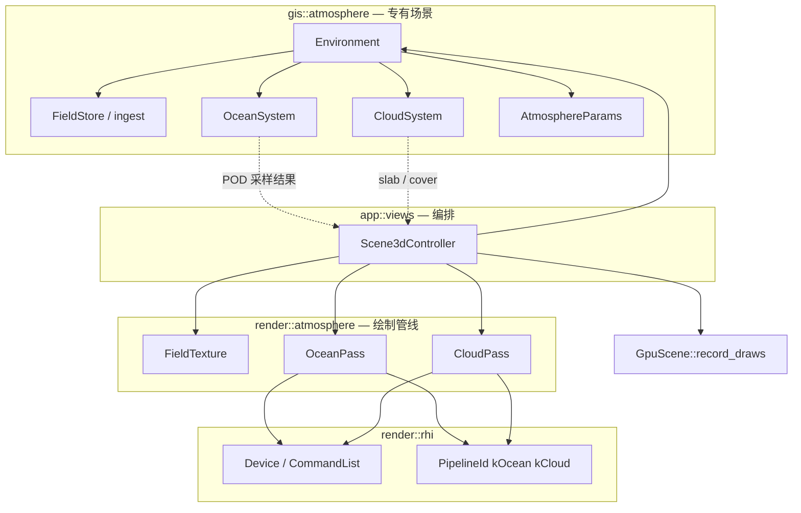

<!--
Copyright (c) 2026 The Mogu Authors.
All rights reserved.
-->

# `src/render/atmosphere` 子目录布局 + 渲染/专有场景剥离


> **Status: landed** (2026-09-28 merge). As-built in `src/render/README.md`; capability living: `2026-09-19-atmosphere-ocean-cloud-design.md`. Do not revise here except mechanical link fixes.

**Status:** landed  
**Date:** 2026-09-27  
**Layout note (2026-09-27):** Public headers are **colocated** with their `.cc` under `ocean/` `cloud/` `sky/` `fog/` `common/` `frame/` (global rule `.cursor/rules/style/colocated-sources.mdc`). Earlier §1 “B headers-at-root” is **superseded** for on-disk layout; includes are `render/atmosphere/<module>/<file>.h`.  
**Scope:** 物理与职责拆分：通用大气 **绘制管线**（`render::atmosphere`）vs GIS **专有场景/会话域**（`gis::atmosphere` + Views 编排）；对照已落地的 `src/render/rhi` 子目录经验；映射典型 GIS 3D 大气诉求到模块边界。**本轮不实现**新散射/云海算法。  
**Related (capability, living):** [`2026-09-19-atmosphere-ocean-cloud-design.md`](2026-09-19-atmosphere-ocean-cloud-design.md) · upgrade plan [`../plans/2026-09-20-atmosphere-ocean-cloud-upgrade.md`](../../plans/2026-09-20-atmosphere-ocean-cloud-upgrade.md)  
**Related (weather domain boundary):** [`2026-09-27-weather-domain-boundary-design.md`](2026-09-27-weather-domain-boundary-design.md) — 天气仿真/会话与 `render` 解耦（active）  
**Related (RHI / scene):** [`2026-09-13-render-rhi-scene-design.md`](../../specs/2026-09-13-render-rhi-scene-design.md) · P0 lit [`2026-09-20-rhi-3d-capability-p0-design.md`](2026-09-20-rhi-3d-capability-p0-design.md) · RHI split (landed) [`../archive/plans/2026-09-27-rhi-subdirectory-split.md`](../plans/2026-09-27-rhi-subdirectory-split.md)  
**Plan (landed):** [`../archive/plans/2026-09-27-atmosphere-subdirectory-layout.md`](../plans/2026-09-27-atmosphere-subdirectory-layout.md)  
**As-built pointer:** [`../../../src/render/README.md`](../../README.md)

## Goal

1. **剥离解耦**：厘清今天混在 atmosphere 车道里的 pass/shader 钩子、场景参数、场数据、宿主编排；明确哪些留在 **render（通用环境绘制）**，哪些属于 **GIS 专有场景**；边界 API 稳定、依赖单向。  
2. **内部抽象 + 子目录**：按职责切开扁平 `ocean_pass` / `cloud_pass` / `field_texture`；公开头路径稳定；实现进子目录；命名空间两层 + `detail`；函数 `snake_case`。  
3. **GIS 3D 诉求映射**：天空散射、日照时间、雾/能见度、云/海、DEM 近地一致性、pass 顺序、与 RHI P0 lit 同轨——写入模块边界（能力可 Deferred，边界先锁）。

## Non-goals

- **不**本轮改写 FFT / raymarch 内核或新增完整 Bruneton/Hillaire 实现（能力仍归 2026-09-19 / upgrade plan）。  
- **不**把 GDI/GL 做成第二套大气真后端；大气只走 `render::rhi` Facade → FlyCube（或 Null 录制）。  
- **不**引入 Qt / Cesium Native / 第二图形引擎；不接 leftover `SmtScene`。  
- **不**新建 atmosphere DLL；仍 `atmosphere_sources` → `//src/render:render`。  
- **不**让 `render` 依赖 `legacy`；**不**把 `gis::FieldStore` / GDAL / `LonLatRing` 反向塞进 RHI Facade。  
- **不**把 Skia 当 3D 大气画布。

---

## §0 现状（CBM / 源码核对，2026-09-27）

### 树

| 路径 | 角色 | 量级 / 备注 |
| --- | --- | --- |
| `src/render/atmosphere/` | 头源同目录：`ocean/` `cloud/` `sky/` `fog/` `common/` `frame/`；`detail/` 内部 | 子目录已落地；`AtmosphereFrame` 固化 pass 顺序 |
| `src/gis/scene/atmosphere/` | `Environment`、`FieldStore`、ingest、procedural、`OceanSystem`、`CloudSystem`、`AtmosphereParams` | 逻辑场已相对清晰 |
| `src/app/views/scene3d_controller.*` | **编排枢纽**：拥有 `Environment` + `OceanPass` + `CloudPass`；`record_atmosphere_*`；GDI 风场叠图 | 产品宿主，非通用 render |
| `src/render/rhi/` | Facade + `stub/` + `flycube/*`；`PipelineId::{kOcean,kCloud}` + ocean compute | 真 GPU 唯一轨 |
| `src/render/scene/GpuScene` | `set_color_load_op` / depth 与大气合成衔接 | 不 `#include` atmosphere |

### 已落地 vs 待做（布局）

| 项 | 状态 |
| --- | --- |
| `gis::atmosphere` vs `render::atmosphere` 双命名空间拆分 | **已落地**（living 2026-09-19） |
| Pass 只 deps `rhi_sources`；无 FlyCube 公开 include | **已落地** |
| `Scene3dController` 内联 ocean→land→cloud 顺序 | **已落地**（经 `AtmosphereFrame`） |
| `render/atmosphere` 子目录 / `AtmosphereFrame` | **已落地** |
| Sky / fog pass 槽位 | **已落地最小实现**（`SkyPass`/`FogPass` + Frame 钩子；物理散射 / `kSky`/`kFog` HLSL Deferred） |
| DEM 深度与近地大气一致性 API | **部分**：共享 depth + `DemRaster::lod_max_edge` 距离 LOD；clipmap Deferred |

### 耦合点



- **健康边界**：`render::atmosphere` **不** include `gis/`；只吃 POD（`OceanDrawParams`、sun 向量、cover 标量、可选 `FieldTexture`）。  
- **混合点**：宿主把 GIS 采样 → pass 参数的胶水写在 `Scene3dController`（可接受为产品缝，但 pass **顺序与 load-op 策略**应回落到 render 侧可测单元）。  
- **RHI**：领域知识（JONSWAP、raymarch 步数）不进 `rhi.h`；仅枚举管线 + CB 钩子（与 upgrade plan §5 一致）。

---

## §1 方案比较与推荐

| 方案 | 做法 | 优点 | 缺点 |
| --- | --- | --- | --- |
| **A. 仅文档** | 保持扁平树，只写边界 | 零 churn | 巨石 `.cc` 继续长；GIS 诉求无槽位 |
| **B. 子目录 + 头在根**（superseded） | `.h` 留模块根；`.cc` 进职责子目录 | 调用方 include 少改 | 头/体分裂；违反 colocated-sources |
| **B′. 头源同目录**（**现行**） | `ocean/ocean_pass.h`+`.cc` 等同目录；include 跟模块路径 | 目录即单元；对齐 legacy/render B′ 与全局规则 | include 路径随模块走 |
| **C. 更深嵌套** | 再拆一层无配对纪律 | — | 多余 churn |

**现行 B′**：`#include "render/atmosphere/ocean/ocean_pass.h"`（及 cloud/sky/fog/common/frame 同类路径）；`AtmosphereFrame` 把「pre-opaque / post-opaque」录制与 load-op 约定从宿主抽回 `render::atmosphere`。

可选后续：`gis/scene/atmosphere` 再拆 `field/` / `ocean/` / `cloud/`——**本规格不强制**。

---

## §2 分层边界（锁定）

| 层 | 命名空间 / 路径 | **留下** | **禁止** |
| --- | --- | --- | --- |
| 逻辑场 / 会话 | `gis::atmosphere` → `src/gis/scene/atmosphere/` | `Environment`、时间轴、太阳方位、`FieldStore`、GDAL ingest、procedural、岸线→`kSeaMask`、Ocean/Cloud **系统**（CPU 采样） | RHI `Device`、FlyCube、`CommandList::draw` |
| GPU 绘制 | `render::atmosphere` → `src/render/atmosphere/` | `*Pass`、`FieldTexture`、频谱/位移 GPU 编排、raymarch GPU、**AtmosphereFrame**（pass 顺序钩子）、未来 sky/fog pass | `FieldStore`、GDAL、`LonLatRing`、Views UI |
| 宿主编排 | `app` / Views | 挂载 Environment、相机矩阵、调用 Frame + GpuScene、面板/CLI | 在 Facade 外 `CreatePipeline`；第二 Device |
| RHI Facade | `render::rhi` | `PipelineId` / `ComputePipelineId` / load-op / lit P0 | 海洋谱参数、云盖场语义 |

### 边界 API（概念）

```cpp
// render::atmosphere — POD in, CommandList out (no gis types)
struct AtmosphereFrameDesc {
  bool ocean_enabled = false;
  bool cloud_enabled = false;
  bool sky_enabled = false;   // future
  bool fog_enabled = false;   // future
  // Host fills OceanDrawParams / sun / slab before record_* .
};

// record_pre_opaque: sky (optional) + ocean (may ColorLoadOp::kClear + depth clear)
// host: GpuScene::record_draws with kLoad when ocean/sky cleared
// record_post_opaque: clouds (alpha, depth test) + fog (optional)
```

`gis::atmosphere::AtmosphereParams` 继续持有会话开关与太阳角；宿主把它 **投影** 成 render POD，而不是让 pass include `atmosphere_params.h`（今日已基本如此；Frame 落地后保持）。

### 依赖方向（锁定）

```
gis::atmosphere  ──✗──►  render::*
render::atmosphere ──► render::rhi   only
app/views        ──► gis::atmosphere + render::atmosphere + render::scene
render::*        ──✗──►  legacy::*
```

---

## §3 目标子目录

```
src/render/atmosphere/
  BUILD.gn
  ocean/     ocean_pass.h|cc (+ cpu_waves, gpu_fields, *_test)
  cloud/     cloud_pass.h|cc (+ *_test)
  sky/       sky_pass.h|cc (+ *_test)
  fog/       fog_pass.h|cc (+ *_test)
  common/    field_texture.h|cc
  frame/     atmosphere_frame.h|cc (+ *_test)  # pre/post opaque + load-op
  detail/    math.h mesh.h raster.h
```

### 子目录职责表

| 子目录 | 职责 | 公开？ |
| --- | --- | --- |
| `ocean/` | 海面位移网格、GPU/CPU FFT 编排、Fresnel；公开 `ocean_pass.h` | 是（头源同目录） |
| `cloud/` | 体积云 deck + raymarch；公开 `cloud_pass.h` | 是 |
| `common/` | `FieldTexture` 上传 / CPU 副本；公开 `field_texture.h` | 是 |
| `frame/` | 合成顺序、与 GpuScene load-op 契约；公开 `atmosphere_frame.h` | 是 |
| `sky/` | 天空散射 / 日照天空色（能力可 Deferred）；公开 `sky_pass.h` | 是 |
| `fog/` | 高度相关雾 / 能见度（能力可 Deferred）；公开 `fog_pass.h` | 是 |
| `detail/` | 跨 TU 内部 helper；第三命名空间段 **仅** `render::atmosphere::detail` | 否 |

### 命名空间与命名

- 公开：`render::atmosphere`（两层）。  
- 内部：`render::atmosphere::detail` 或匿名命名空间。  
- 函数 `snake_case`；类型 PascalCase。  
- **禁止** `render::atmosphere::ocean::…` 作为公开第三语义层。

---

## §4 典型 GIS 3D 诉求 → 模块映射

| 诉求 | 逻辑 / 会话（`gis::atmosphere`） | 绘制（`render::atmosphere`） | 衔接 | 现状 |
| --- | --- | --- | --- | --- |
| 全球/区域椭球或 ECEF 下大气散射 / sky | 太阳、观察者高度、可选椭圆参数 POD | `SkyPass`（LUT/近似散射） | `AtmosphereFrame::record_pre_opaque` 最先 | **最小可用**：analytical dome + sun tint（`kSolid`）；LUT Deferred |
| 日照 / 太阳位置与时间 | `Environment::time_sec` + az/el（可升太阳历） | pass 只收归一化太阳方向 / 色温 POD | 宿主投影 | **部分**：az/el → sky/cloud；无天文历 |
| 雾 / 能见度与高度衰减 | `AtmosphereParams` fog 字段 | `FogPass`（post 或与 lit 合 CB） | post-opaque 或 lit fog 因子 | **最小可用**：高度/距离指数雾 + 共享 depth test |
| 云层（体积/层状） | `CloudSystem` + Field 通道 | `CloudPass` | post-opaque，depth test | **已有** |
| 海洋 | `OceanSystem` + 海掩膜 | `OceanPass` | pre-opaque clear | **已有** |
| DEM / 地形遮挡与近地大气一致 | World / DEM 高度采样（gis/scene） | 共享 depth RT；雾/天空用观察者相对地面高度 | GpuScene depth + Frame 约定 | **部分**：共享 depth + 高度雾；DEM `lod_max_edge` |
| Camera / LOD / pass 顺序 | 相机在宿主 / GpuScene | Frame 固定：`sky → ocean → [opaque GpuScene] → cloud → fog` | `ColorLoadOp`/`DepthLoadOp` | **已落地**（sky/fog 最小实现 + DEM 距离 LOD） |
| 与 RHI P0 lit 同轨 | — | 陆地/模型继续 `kLitSolid`；大气不另开 Device | 禁止双轨光栅 | **锁定** |

绘制顺序（锁定，与今日行为兼容并预留槽）：

```
sky (optional, clear) → ocean (clear if no sky) → opaque (GpuScene lit/solid, load)
  → cloud (load, alpha, depth test) → fog (optional) → present
```

---

## §5 与 RHI P0 / 既有 atmosphere 规格的关系

- **能力真源**仍是 [`2026-09-19-atmosphere-ocean-cloud-design.md`](2026-09-19-atmosphere-ocean-cloud-design.md)；本文件 **修订其「目录与 GN」表中的扁平假设**，不改 FieldStore / FFT / 云算法决议。  
- **P0 lit**（`kLitSolid`）独占地形/模型着色；atmosphere **不得**复制一套 lit 陆地管线。  
- 新增 sky/fog 时：只扩 **窄** `PipelineId`（与 upgrade §5 同原则）；HLSL 仍在 `rhi/flycube`，编排在 `render::atmosphere`。  
- upgrade plan Phase 3.3（Sky LUT）落地时应落在本规格的 `sky/` 槽，而不是堆回扁平根目录。

---

## §6 成功标准

1. Living design（本文）Status `accepted`，含分层、目标树、GIS 映射、依赖方向。  
2. Implementation plan 含 Phase、Non-goals、锁定决策表、Path ownership。  
3. 落地后：公开 include 路径不变；`ocean_pass_test` / `cloud_pass_test`（及 Frame 测试）Null 绿；`Scene3dController` 态机行为不变。  
4. `src/render/README.md` atmosphere 行更新为子目录 as-built（实现 PR 同改）。

## §7 Weather domain boundary（指针）

「天气系统」作为领域/仿真/会话抽象（状态机、时间轴、气象场、预报回放）**必须**与 `render::atmosphere` 解耦：render 只吃 POD + 纹理，不吃 GRIB/FieldStore/业务类型。完整归属表、方案对比（扩展 `gis::atmosphere` vs 新 `gis::weather` vs content 会话）、反模式与 strangler 步骤见：

→ [`2026-09-27-weather-domain-boundary-design.md`](2026-09-27-weather-domain-boundary-design.md)

本文件仍只锁定 **GPU 子目录 / Frame / GIS 3D 绘制映射**；不在此重复天气状态机设计。

## Out of scope for later

- 完整 Hillaire/Bruneton、多次散射云、浅水步进、风场粒子 GPU（仍归 capability / upgrade）。  
- `gis/scene/atmosphere` 物理子目录拆分。  
- leftover GL fog（`SmtGLRenderDevice::SetFog`）迁移——**明确不做**；新雾只走 RHI 轨。
