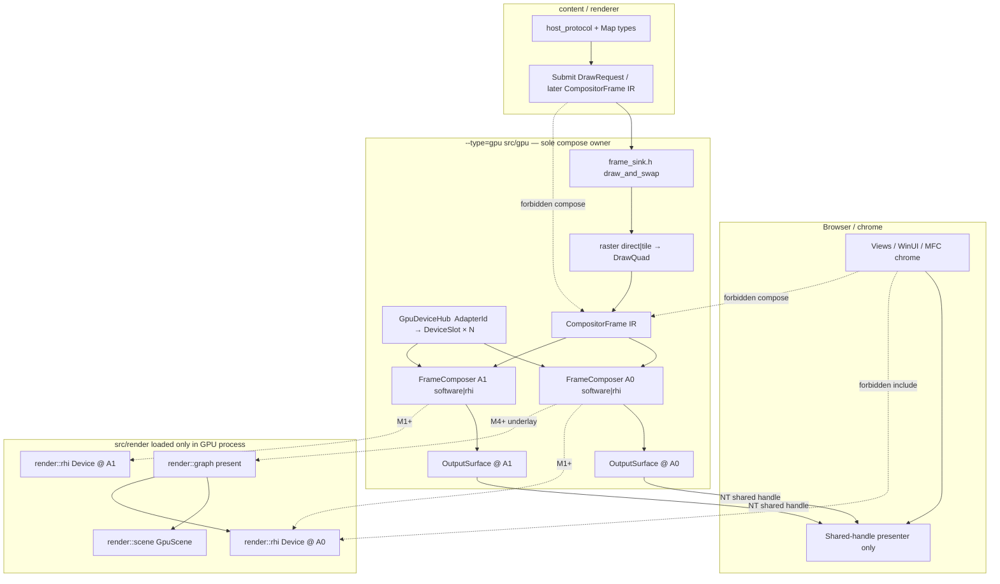

<!--
Copyright (c) 2026 The Mogu Authors.
All rights reserved.
-->

# GPU process RHI accelerate abstraction


> **Status: superseded** (2026-09-28 merge). Merged into `2026-09-13-render-rhi-scene-design.md` §GPU-process accelerate. Do not revise here except mechanical link fixes.  
> **Diagram (living):** [`../../diagrams/render-accelerate-topology.html`](../../diagrams/render-accelerate-topology.html) · Plan checklist [`../../plans/2026-09-27-gpu-rhi-accelerate.md`](../../plans/2026-09-27-gpu-rhi-accelerate.md)

**Status:** active  
**Date:** 2026-09-27  
**Note (2026-09-27 landing):** M0–M5 code paths are in tree under multi-GPU GPU-process compose. FlyCube DX12 **shared NT import** + **compose-into-shared** are implemented (`OpenSharedHandle`, `execute_to_imported`). DIB-only / failed import still uses `upload_bgra`. Keep `active` until human dual-adapter + multiprocess smoke accepts pixel path.  
**Scope:** GPU-process-only compose/present for `--type=gpu` (`src/gpu`), with **first-class multi-adapter / multi-GPU** support; keep `CompositorFrame` as IR; integrate `render::rhi` (FlyCube) incrementally.  
**Plan:** [`../plans/2026-09-27-gpu-rhi-accelerate.md`](../../plans/2026-09-27-gpu-rhi-accelerate.md)  
**Related:** as-built paint [`../../../src/gpu/README.md`](../../README.md)；layout landed [`2026-09-27-gpu-subdirectory-layout-design.md`](2026-09-27-gpu-subdirectory-layout-design.md)；RHI + dual scene [`2026-09-13-render-rhi-scene-design.md`](../../specs/2026-09-13-render-rhi-scene-design.md)；Frame Graph [`2026-09-27-render-frame-graph-design.md`](2026-09-27-render-frame-graph-design.md)；multiprocess shell [`../../ui-shell-multiprocess.md`](../../ui-shell-multiprocess.md)；CPU map frame [`2026-09-27-map2d-frame-design.md`](2026-09-27-map2d-frame-design.md)；product Pass 终态 `src/vista/component/map`；MapLibre Native pin removed（deferred）[`../archive/specs/2026-09-27-maplibre-out-of-gpu-design.md`](2026-09-27-maplibre-out-of-gpu-design.md)。

## Normative constraint (supersedes prior M0–M5 single-device assumptions)

1. **All compositing runs in the GPU process** (`--type=gpu` / `src/gpu`). Browser / renderer / chrome **must not** blend map layers into the final frame. They submit draw / composition work (recorded frames, layer trees, or quad batches) **to the GPU process**, which alone blends and presents onto shared surfaces.
2. **Multi-GPU rendering is first-class.** One GPU process drives **N adapters / devices** (multi-monitor, multi-view, discrete + iGPU). Each view / `OutputSurface` is pinned to an `AdapterId`. Present is per-output; there is **no** assumption of a single global D3D/RHI device.

Default topology: **1 GPU process × N RHI/D3D devices** (not N gpu processes unless a later recovery policy explicitly justifies per-adapter child processes).

## Why a new spec

- [`2026-09-27-gpu-subdirectory-layout-design.md`](2026-09-27-gpu-subdirectory-layout-design.md) is **landed** and scoped to directory layout + software compose. Expanding it into RHI acceleration would muddy a finished layout decision.
- [`2026-09-27-render-frame-graph-design.md`](2026-09-27-render-frame-graph-design.md) owns **in-process** `render::graph::present` for Views `MapScene` / `Scene3dController` (Effect slots, one camera, one present). That is a different call path from `--type=gpu` compose.
- This document owns the **GPU-process** seam: record / receive quads → **compose in gpu** → upload/present onto an `OutputSurface` bound to an adapter, and how that seam may later consume RHI textures / Frame Graph outputs without chrome including RHI.

## Today's facts (verified against tree)

| Fact | Location |
| --- | --- |
| One draw entry `draw_and_swap` | `src/gpu/frame_sink.h` |
| Raster records `DrawQuad` → `RenderPass` → `CompositorFrame` | `src/gpu/compositor/compositor_frame.h`, `raster/*` |
| `SoftwareRenderer` CPU blends root pass, then `OutputSurface::upload_bgra` once | `compositor/software_renderer.*`, `display/output_surface.*` |
| `OutputSurface::create_dxgi` uses `D3D11CreateDevice(nullptr, HARDWARE, …)` — **one implicit adapter, no hub** | `display/output_surface.cc` |
| `//src/gpu:gpu_backend` has **no** `//src/render` dep | `src/gpu/BUILD.gn` |
| `view.backend.rhi` selects `ContentSource::kDirect` only (not FlyCube) | `frame_sink.h` (`kCmdContentDirect`) |
| `OutputSurface` is DXGI shared texture (D3D11) or software DIB; pixels `B8G8R8A8_UNORM` | `display/output_surface.h` |
| Product RHI is `render::rhi` Facade; FlyCube in `src/render/rhi` impl TUs | `src/render/rhi/rhi.h` |
| Chrome presents shared NT handle only | `docs/superpowers/ui-shell-multiprocess.md` §0 |

## Goals

1. Keep **`CompositorFrame` / `DrawQuad` / `RenderPass` as the IR** between record and display. Do not invent a second quad model.
2. **Compose only inside the GPU process.** Final blend/present never runs in browser, renderer, or chrome. Software compose is allowed only as a **per-device fallback inside `--type=gpu`**.
3. Introduce a **pluggable compose/present backend** behind `FrameComposer`: `kSoftware` (default) and `kRhi` (opt-in), each bound to an adapter device slot.
4. Introduce **`GpuDeviceHub` + `AdapterId`**: enumerate adapters, create/reuse one device slot per adapter, pin each `OutputSurface` / view to an `AdapterId`, run **one `FrameComposer` per device** (or per draw using that device).
5. Milestone 1 acceleration: same IR; replace CPU blend + `upload_bgra` on the **bound adapter’s** path with RHI present onto the **existing DXGI shared surface** for that surface (or DIB fallback).
6. Later: GPU compose of `kSolid` / `kBgra`; optional bridge from `GpuScene` / `effect::map` Pass / Frame Graph textures into compositor quads or a sibling underlay pass — still per adapter inside gpu.
7. Preserve process isolation: chrome / `app/` / `content/` never `#include` `render/rhi` or `gpu/compositor/`. Public GPU draw stays `frame_sink.h` / `gpu/gpu.h`. Content/renderer may **send** frame IR over IPC; they do not execute compose.
8. Software path remains the CI and fallback default until RHI present proves pixel-stable **per adapter**.

## Non-goals

- Do not rename `view.backend.rhi` / `ContentSource` in this work (wire strings stay; document that the command means **direct content**, not FlyCube).
- Do not require chrome to host FlyCube, or merge browser + GPU into one process.
- Do not put Skia, MapLibre `mbgl::Map`, or a second engine on the compose path.
- Do not make `render::graph` depend on `gpu/` or the reverse for Frame Graph core; bridging is adapter-only inside the GPU process.
- Do not rewrite leftover `Smt_*` devices as the acceleration path.
- Do not claim as-built multi-GPU RHI acceleration in `src/gpu/README.md` until a milestone lands pixels through a hub-bound device.
- Do not spawn one gpu process per adapter by default.
- Agents do not run `build.bat` / `gn` / `ninja`; humans verify acceptance checks.

## Recommended approach (locked)

**Incremental: keep DrawQuad IR; GPU-process-only compose; multi-adapter hub first; swap blend+upload per device; full GPU compose and Frame Graph underlay later.**

| Option | Summary | Verdict |
| --- | --- | --- |
| A. Big-bang: gpu records only into Frame Graph / GpuScene | Deletes software IR early; high risk to tile/direct tests | Reject |
| B. Dual engines forever (software compositor + separate RHI map) | Two present paths, divergent pixels | Reject as end state |
| C. Compose in chrome / renderer then upload | Violates normative constraint §1 | **Reject** |
| D. One gpu process per adapter | Extra process tax without proof; recovery can revisit | Reject as default |
| **E. `GpuDeviceHub` + per-device `FrameComposer` behind `CompositorFrame`** | Same IR; software default **per device** inside gpu; `kRhi` grows blit → GPU compose → optional graph underlay | **Accept** |

## Abstraction layers

Public namespaces stay two levels (`gpu`, `render::rhi`, `render::graph`, `render::scene`). Internals under `gpu::detail` / `…::detail`.

| Layer | Namespace | Types (planned) | Owns |
| --- | --- | --- | --- |
| Public draw | `gpu` | `DrawRequest`, `ContentSource`, `draw_and_swap` | Unchanged contract; surface carries `AdapterId` |
| Device hub | `gpu::detail` | `AdapterId`, `AdapterInfo`, `GpuDeviceHub`, `DeviceSlot` | Enumerate adapters; create/reuse devices; bind surfaces |
| Frame IR | `gpu::detail` | `DrawQuad`, `RenderPass`, `CompositorFrame` | Recorded quads; last pass = root |
| Compose/present | `gpu::detail` | `FrameComposer`, `SoftwareComposer`, `RhiComposer` | Execute IR → surface **on one device** |
| Surface | `gpu::detail` | `OutputSurface` | DXGI shared / DIB on a pinned adapter; wire handle for browser |
| RHI Facade | `render::rhi` | `Device`, `CommandList`, `Texture`, `Buffer` | One FlyCube/Null device per `AdapterId` slot |
| Frame Graph | `render::graph` | `Effect`, `ViewInput`, `present` | In-process 3D/2D Effect present (Views host today; M4+ underlay in gpu) |
| GPU scene | `render::scene` | `GpuScene`, `OpaqueEffect` | GPU instances; not compositor IR |

### Planned interfaces (names locked for the plan)

```cpp
// gpu/device/adapter_id.h  (planned)
namespace gpu {
namespace detail {

using AdapterId = uint32_t;
inline constexpr AdapterId kAdapterPrimary = 0;
inline constexpr AdapterId kAdapterInvalid = 0xffffffffu;

struct AdapterInfo {
  AdapterId id = kAdapterInvalid;
  bool is_hardware = false;
  // DXGI LUID / descriptive name for logs; no FlyCube types here.
  uint64_t luid = 0;
  char description[128] = {};
};

}  // namespace detail
}  // namespace gpu
```

```cpp
// gpu/device/gpu_device_hub.h  (planned)
namespace gpu {
namespace detail {

// Process-wide hub: one GPU process, N device slots.
class GpuDeviceHub {
 public:
  static GpuDeviceHub& instance();

  // Enumerate DXGI adapters (or a stub list of {kAdapterPrimary} until M1).
  std::vector<AdapterInfo> enumerate_adapters() const;

  AdapterId primary_adapter() const;
  // Prefer the adapter that owns |monitor| / HMONITOR affinity; fall back primary.
  AdapterId prefer_adapter_for_monitor(void* hmonitor) const;

  // Bind surface lifetime to an adapter. Creates the device slot lazily.
  bool bind_surface(OutputSurface* surface, AdapterId adapter);
  AdapterId adapter_of(const OutputSurface* surface) const;

  // Non-owning. Null only before first bind / when adapter unknown.
  // RHI Device* lives inside the slot when kRhi is live (opaque void* at hub API).
  void* rhi_device_for(AdapterId adapter);

 private:
  // DeviceSlot: AdapterId + optional D3D11 display device + optional rhi::Device
  // + sticky software-fallback flag for that adapter.
};

GpuDeviceHub& device_hub();

}  // namespace detail
}  // namespace gpu
```

```cpp
// gpu/compositor/frame_composer.h  (planned)
namespace gpu {
namespace detail {

enum class ComposeBackend {
  kSoftware = 0,  // default: today's SoftwareRenderer path (per device)
  kRhi = 1,       // opt-in: render::rhi compose/present on that adapter
};

// Executes one CompositorFrame onto OutputSurface using the surface's adapter.
// Exactly one present per call. Never composites in chrome.
class FrameComposer {
 public:
  virtual ~FrameComposer() = default;
  virtual ComposeBackend backend() const = 0;
  virtual AdapterId adapter() const = 0;
  virtual bool draw_frame(OutputSurface* surface,
                          const CompositorFrame& frame) = 0;
};

ComposeBackend select_compose_backend();
void set_compose_backend(ComposeBackend backend);
void clear_compose_backend_override();

// Factory used by display::draw_and_swap. Never returns null.
// |adapter| selects which device slot owns the composer resources.
std::unique_ptr<FrameComposer> make_frame_composer(ComposeBackend backend,
                                                   AdapterId adapter);

}  // namespace detail
}  // namespace gpu
```

- `SoftwareComposer` wraps today's `SoftwareRenderer::draw_frame` / `blend_render_pass` + `upload_bgra` (may keep class name `SoftwareRenderer` as the implementation type; the **seam** name is `FrameComposer`). Still runs **inside the GPU process**, on the surface’s bound adapter path.
- `RhiComposer` holds a non-owning `render::rhi::Device*` from `GpuDeviceHub` for that `AdapterId`. It must not appear on `frame_sink.h`.
- `display.cc` calls `make_frame_composer(select_compose_backend(), adapter_of(surface))->draw_frame` instead of constructing `SoftwareRenderer` directly.
- Unbound surfaces default to `kAdapterPrimary` so existing single-surface tests stay green.

## IPC: who sends what

| Sender | Sends | Does **not** |
| --- | --- | --- |
| **Browser / chrome** | View create/resize/extent, present-mode preference; opens NT shared handle and presents only | Compose / blend / RHI device / `CompositorFrame` execution |
| **Renderer / content** (target) | Draw intents, map state, and eventually **serialized `CompositorFrame` / quad batches** (or layer-tree records) into the GPU process | Final blend into the shared surface |
| **GPU process** | Raster (until record moves fully to renderer), **compose**, present into `OutputSurface`, `SharedHandle` + `FrameReady` wire | Visible chrome HWND ownership |

Near-term (M0–M2): raster may still run **inside** the GPU process (`draw_and_swap` records then composes). That is allowed; the normative rule is that **compose/present** never leave gpu. Mid-term: push record toward renderer/content and ship IR to gpu for compose-only — same `CompositorFrame` IR, same hub.

Chrome **never** receives raw quad lists for local compose. It only presents the shared handle the GPU process published.

## OutputSurface ↔ RHI mapping (per adapter)

| Surface mode | Today | Multi-GPU RHI mapping |
| --- | --- | --- |
| `kSoftwareDib` | CPU bits + `upload_bgra` / `copy_bgra` | Keep software composer on that adapter, or RHI → readback → DIB (debug only) |
| DXGI shared (D3D11 texture today) | `D3D11CreateDevice(nullptr)` + `upload_bgra` | Create / open shared texture **on the bound adapter’s** D3D device; **M1:** import NT handle into that adapter’s FlyCube DX12 device. Sync: today’s frame-ready IPC as cross-process fence; keyed mutex / fence if import needs it |
| Browser present | Opens shared handle; presents only | Unchanged. Chrome never creates RHI devices and never picks adapters for compose |

Rules:

1. **One present per frame per surface** still: composer finishes, then surface generation / wire advances exactly as today's success contract.
2. Do not add a second shared texture for RHI; avoid double-buffer protocol churn in M1–M2.
3. Pixel format stays **BGRA8** on the wire.
4. `OutputSurface::has_d3d_device()` reflects the **display** D3D11 device for that surface’s adapter. RHI may use a **separate** FlyCube DX12 device on the **same adapter LUID**. Do not assume one process-global device pointer.
5. If import or RHI init fails **for that adapter** → fall back to `SoftwareComposer` for that adapter (sticky), not for unrelated adapters.
6. Cross-adapter blit (view on GPU-A, monitor on GPU-B) is out of M0–M2; prefer pin surface to the output’s preferred adapter (`prefer_adapter_for_monitor`).

## Relationship: who owns what



| Owner | Responsibility |
| --- | --- |
| `src/gpu` | Hub, adapters, record IR (near-term), choose compose backend **per device**, own `OutputSurface`, expose `draw_and_swap` |
| `src/render/rhi` | One Device / resources / command lists **per AdapterId**; FlyCube impl private |
| `src/render/graph` | Effect-ordered present for hosts that already have a `Device` + camera |
| `src/render/scene` | `GpuScene` sync + opaque draws on a chosen device |
| `gis::vista` / `gis::present` | CPU map frame + Style/tile inputs; no RHI (`effect::map` owns Pass) |
| `content` / chrome | IPC + present shared pixels; **no** `render/rhi`, **no** `gpu/compositor`, **no** final compose |

**No chrome include of RHI** is normative. GPU process may `deps` a narrow RHI target from `gpu_backend` when `kRhi` is compiled in; prefer a GN flag so default `gpu_backend` stays free of FlyCube link cost until opted in.

### Frame Graph vs Compositor (do not merge prematurely)

| | Compositor (`src/gpu`) | Frame Graph (`src/render/graph`) |
| --- | --- | --- |
| IR | `CompositorFrame` quads | `Effect::record` into one `CommandList` |
| Camera | None (pixel quads) | One `CameraMatrices` |
| Present target | `OutputSurface` shared to browser (per adapter) | `rhi::Device` swapchain / window (host-owned today) |
| Typical content | Direct demo, Style/XYZ tile quads, DEM underlay bitmaps | Map meshes, terrain/models, atmosphere Effects |

Bridge pattern (M4+): Frame Graph (or `GpuScene`) renders an underlay **texture on the same AdapterId**; an adapter wraps that texture as a `DrawQuad` or pre-compose blit into the shared surface **before** overlay quads. Do not teach `frame_graph.cc` about `OutputSurface`.

## Phased milestones + acceptance

Humans run the listed commands. Agents edit sources/docs only.

| Phase | Deliverable | Acceptance (human) |
| --- | --- | --- |
| **M0** | `AdapterId` + `GpuDeviceHub` stub (at least primary); `FrameComposer` seam; `SoftwareComposer` = today's path **per bound adapter**; env/override for backend; surfaces default to `kAdapterPrimary`; docs | `build.bat render_backend_test.exe` then `out\render_backend_test.exe` — all existing cases green; default backend still software; compose still only in gpu |
| **M1** | Hub enumerates real DXGI adapters; `OutputSurface` DXGI create on bound adapter; `RhiComposer` opt-in: CPU blend then RHI present into **that** shared surface; sticky software fallback **per adapter** | With `SMT_GPU_COMPOSE=rhi`, multi-view / dual-adapter smoke: each surface presents on its pin; shared-handle non-black; software fallback if one adapter’s RHI fails; `render_backend_test` default-green |
| **M2** | GPU compose for `kSolid` + `kBgra` (+ `replaces`) on RHI **per device**; skip full CPU `blend_render_pass` when `kRhi` live | Tile opacity / multi-raster / replaces under RHI; TDR on one adapter does not take down browser or other adapters’ composers |
| **M3** | Quad materials / texture cache **per DeviceSlot**; reuse uploaded tile textures across frames | Frame time / upload bytes drop on XYZ mosaic; no protocol change |
| **M4** | Optional underlay: `GpuScene` / `render::graph::present` → texture on same `AdapterId` → compositor root | Scene3d / map RHI underlay visible through same shared handle; chrome still present-only |
| **M5** | Policy: automatic fallback, per-adapter device-lost / TDR recovery, document `SMT_GPU_COMPOSE` + adapter pin env | Kill GPU child → browser resurrects surfaces; force software; rebind view to another adapter when preferred monitor changes |

## Risks

| Risk | Mitigation |
| --- | --- |
| **TDR / device removed on one adapter** | Isolate in GPU process; destroy that slot’s `RhiComposer` resources; sticky software for **that** `AdapterId`; bump that surface’s generation; leave other adapters running |
| **Cross-process shared texture (D3D11 vs DX12) per adapter** | **Landed:** `OutputSurface` NT handle is `READ\|WRITE`; `FlycubeDevice::import_shared_nt_handle` uses D3D12 `OpenSharedHandle` + RTV; compose via `execute_to_imported` or `copy_bgra_to_imported_shared`. Fallback `upload_bgra` for DIB / import failure. Same `adapter_index` on hub + DeviceDesc. |
| **Wrong adapter / multi-monitor tear** | Pin at view create via `prefer_adapter_for_monitor`; document; M5 rebind |
| **Software fallback drift** | One IR; `render_backend_test` remains software-default; RHI tests additive |
| **BGRA vs RGBA** | Explicit format or swizzle at composer boundary; wire stays BGRA |
| **Link weight / GN cycles** | Optional `gpu_rhi` source_set; `graph` must not depend on `gpu` |
| **Name confusion `view.backend.rhi`** | Document only; rename is a separate wire task |
| **Double present** | `FrameComposer` owns shared-surface update; Frame Graph adapters must not also present the browser swapchain |
| **Accidental compose in chrome** | Code review + README: chrome present-only; no `SoftwareRenderer` / `FrameComposer` outside `src/gpu` |

## Testing strategy

- Keep `render_backend_test` as the software contract suite (no FlyCube required).
- Add `gpu_rhi_composer_test` (Null `render::rhi::Device` where possible; DX12 smoke behind env) for hub binding, composer selection, per-adapter fallback, BGRA order.
- Hand-test: multiprocess shell with two views on two adapters when hardware allows; DXGI shared handles + `SMT_GPU_COMPOSE=rhi`.
- Do not require `SmartGisViews.exe` Frame Graph tests to pass through `src/gpu` until M4.

## Doc updates when landing code

- As-built facts → `src/gpu/README.md` architecture diagram (`GpuDeviceHub` + `FrameComposer`) and **RHI acceleration** subsection marked landed per phase.
- Keep this spec `active` until M2 (GPU compose on at least one real multi-adapter path or documented single-adapter subset) is accepted; then consider `landed` + archive with the plan per `superpowers-docs` lifecycle.
