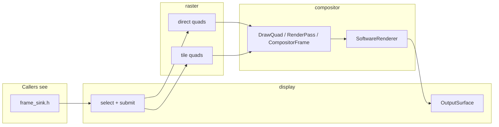

<!--
Copyright (c) 2026 The Mogu Authors.
All rights reserved.
-->

# `src/gpu` subdirectory layout


> **Status: landed** (2026-09-28 merge). As-built in `src/gpu/README.md`. Do not revise here except mechanical link fixes.

**Date:** 2026-09-27  
**Status:** landed  
**Scope:** Physical layout of `src/gpu`: display output, a software compositor, and direct / tile raster.  
**Related:** as-built [`../../../src/gpu/README.md`](../../../src/gpu/README.md); peer precedent [`../archive/plans/2026-09-27-rhi-subdirectory-split.md`](../archive/plans/2026-09-27-rhi-subdirectory-split.md); follow-on RHI accelerate (active, not layout) [`2026-09-27-gpu-rhi-accelerate-design.md`](2026-09-27-gpu-rhi-accelerate-design.md). **MapLibre Native pin:** removed 2026-09-27 (deferred reconsider) — archived [`../archive/specs/2026-09-27-maplibre-out-of-gpu-design.md`](../archive/specs/2026-09-27-maplibre-out-of-gpu-design.md).

## Goal

1. Public process entry stays `gpu/gpu.h` (`GpuMain`, `LegacyHost`, `create_legacy_host`, `render_main`, `run_self_test`).
2. `display/output_surface` is the pixel surface only (DXGI shared texture + software DIB). Demo drawing is not an `OutputSurface` method.
3. `frame_sink.h` is the public draw boundary (`ContentSource` direct / tile, `DrawRequest`, `draw_and_swap`). `display/display.cc` chooses content and submits one frame. Callers do not name the implementation directories.
4. MapLibre Native is **not** in this module (pin removed). Tile selection stays StyleDocument via `ContentSource::kTile`; wire name `maplibre` is a tile alias only.

## Non-goals

- Do not change basemap compositing, viewport XYZ mosaic, degenerate `0/0/0` fallback, or DXGI/DIB present behavior.
- Do not build full `mbgl::Map` / HeadlessFrontend, a second graphics engine, or a new rasterizer.
- Do not let `app/` or `content/` include `mln/` / `mbgl/` or `gpu/compositor/`.

## Tree

```
src/gpu/
  gpu.h  gpu_main.cc  legacy_host.cc  self_test.cc  gpu_exe.cc
  frame_sink.h
  display/output_surface.h  display/output_surface.cc
  display/display.h  display/display.cc
  compositor/compositor_frame.h
  compositor/software_renderer.h  compositor/software_renderer.cc
  raster/tile/decode.h  raster/tile/decode.cc
  raster/tile/mosaic.h  raster/tile/mosaic.cc
  raster/tile/fetch.cc
  raster/tile/tile_quads.h  raster/tile/tile_quads.cc
  raster/direct/direct.h  raster/direct/direct.cc
  raster/direct/mesh.h  raster/direct/mesh.cc
```

`//src/gpu:gpu_backend` keeps the display, compositor, and raster sources. `//src/gpu:gpu_lib` stays the process entry. There is no `maplibre.gni` / `smt_enable_maplibre` under gpu.

Namespaces stay `gpu` and `gpu::detail`. No shim headers at the old `paint/` or `present/` paths.

## Draw path

`select_content_source` reads `SMT_MAP_BACKEND=a|track_a|maplibre` as tile and otherwise direct. `set_content_source` beats the environment. Commands `view.backend.rhi` / `view.backend.maplibre` stay. Wire integer 0 is direct; 1 is tile.

`draw_and_swap` is the only draw entry `gpu_main` calls. It records one `CompositorFrame` and `SoftwareRenderer` uploads once:

- Scene3d draws the direct demo frame (DEM underlay) and returns true. It is not a third mode.
- Tile runs StyleDocument quad recording after the size check. A null surface or a 0 size falls back to a direct clear on a live surface.
- Direct runs the demo clear plus the 2D grid.

`try_maplibre_still_image`, `MaplibreStill`, and `maplibre_link_*` stay gone. Tile pixels use StyleDocument compositing only.

### Architecture (as-built)

Authoritative prose + diagrams live in [`../../../src/gpu/README.md`](../../../src/gpu/README.md). Module shape:



**Compositor contract:** root `RenderPass` is back-to-front; materials are
`kSolid` (ARGB + opacity) and `kBgra` (tight buffer owned by `RenderPass::image_data`);
`replaces=true` copies finished bitmaps instead of src-over. `SoftwareRenderer::draw_frame`
blends only `render_pass_list.back()` then presents once.
