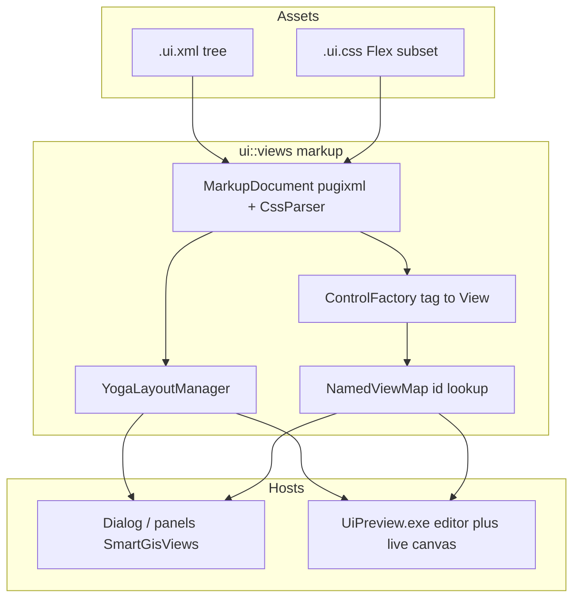

<!--
Copyright (c) 2026 The Mogu Authors.
All rights reserved.
-->

> **Status: superseded** (2026-09-28 merge B). Merged into [`../../specs/2026-09-27-views-desktop-shell-design.md`](../../specs/2026-09-27-views-desktop-shell-design.md) — §Declarative markup XML+Yoga (folded). Do not revise here except mechanical link fixes; revise the living umbrella in place.


# Design: Views declarative markup (XML + Yoga Flex CSS) + UiPreview

**Status:** superseded (2026-09-28 merge B)
**Date:** 2026-09-28  
**Updated:** 2026-09-28 — ControlFactory registration moved out of factory-core TU; see § Layering / ControlFactory registration.

**Living files considered:** [`2026-09-13-ui-views-controls-design.md`](2026-09-13-ui-views-controls-design.md) (toolkit primitives, layout managers, GIS panels inventory); [`2026-09-27-views-desktop-shell-design.md`](2026-09-27-views-desktop-shell-design.md) (product shell host pattern); [`2026-09-28-third-party-json-xml-protobuf-design.md`](2026-09-28-third-party-json-xml-protobuf-design.md) (pugixml pin policy).  
**Why a new dated file:** this is a **new top-level subsystem** — declarative resource format (`.ui.xml` / `.ui.css`), Yoga-backed layout path, ControlFactory + NamedViewMap binding, and a separate `UiPreview.exe` editor host. Folding into ui-views-controls would bury a full markup/IR/editor contract inside a controls inventory doc and force contradictory “commandative toolkit only” vs “markup-first dialogs” narratives in one file. Controls remains the owner of View primitives; this spec owns the declarative pipeline and preview tool.

**Plan:** [`../plans/2026-09-28-views-declarative-markup.md`](../plans/2026-09-28-views-declarative-markup.md)

**Related:** `src/ui/views/README.md` (primitives list; update when markup/ lands); `docs/build/ui-views-skia.md` (Views + Skia endgame).

---

## Locked decisions

| ID | Decision |
| --- | --- |
| **A+C** | Same milestone: runtime declarative load **and** drag-visual editor (`UiPreview.exe`) ship together for acceptance. |
| **F** | Toolkit primitives should be instantiable from XML. Complex GIS panels use **placeholder Views** first (id / size); business data stays C++-bound. |
| **W** | Desktop paint = **Views + Skia**. Layout = **Yoga (W3C Flexbox)**. Structure = **XML via pugixml**. Style = **Flex-aligned CSS subset** (not a full browser CSS engine). |
| **NO-QT** | Do not introduce Qt. |
| **NO-DESKTOP-WEBVIEW** | This milestone: desktop chrome does **not** embed WebView2 / a real HTML engine. |
| **MOBILE-WEBVIEW-FUTURE** | Future mobile may adapt the **same resources** via WebView / equivalent HTML+Flex CSS. This milestone only keeps IR mappable; **no** mobile app, **no** HTML exporter. |
| **GIT** | Work on `master`. Partition parallel agents by non-overlapping paths. |

---

## Goal

Ship a declarative UI path on the existing Views + Skia desktop stack:

1. Load `.ui.xml` + `.ui.css` at runtime into a `View` tree (Yoga layout → `View::set_bounds`).
2. Thin product C++ binds callbacks / data by id (`NamedViewMap`).
3. Deliver `out/UiPreview.exe`: live canvas on the same pipeline + palette / select / properties / tree / drag insert-reorder, with open/save/hot-reload.

Acceptance sample: migrate `AddBasemap` and `AttStruct` dialogs to markup (≥2 dialogs).

---

## Architecture



| Layer | Responsibility | Land |
| --- | --- | --- |
| Assets | `.ui.xml` + `.ui.css` | e.g. `src/ui/views/markup/testdata/`, product `resources/ui/` |
| Parse | pugixml + in-tree Flex CSS subset | `src/ui/views/markup/` |
| Layout | Yoga rects → `View::set_bounds` | `YogaLayoutManager` implements existing `LayoutManager` |
| Controls | XML tag → `Label` / `Button` / … | Cover README primitives; GIS tags → placeholder or existing type |
| Bind | `find_view_by_id` / typed cast | Thin dialog C++ for callbacks + data |
| Preview | Open / save / hot-reload + editor chrome | `src/app/ui_preview/` → `out/UiPreview.exe` |

Existing `BoxLayout` / `FillLayout` **remain** for unmigrated imperative code. New declarative hosts default to Yoga. Do **not** dual-drive the same host with both layout systems.

Public API sketch: `ui::views::load_markup(path_or_bytes, MarkupOptions) -> MarkupRoot` (owns root `View` + id map).

---

## Resource format (v1)

### XML (illustrative)

```xml
<ui name="add_basemap">
  <style src="add_basemap.ui.css"/>
  <vbox id="root" class="form">
    <label id="name_label" text="Layer name"/>
    <textfield id="name" text="Basemap"/>
    <label text="Kind"/>
    <combobox id="kind"><item text="xyz"/><item text="wmts"/></combobox>
    <label text="URL template"/>
    <textfield id="url"/>
  </vbox>
</ui>
```

### CSS subset (Flex-aligned; not full browser CSS)

- Selectors: `tag` / `#id` / `.class` (no combinators, no pseudo-classes in v1).
- Properties: `display:flex|none`, `flex-direction`, `justify-content`, `align-items`, `flex` / `flex-grow`, `gap`, `padding` / `margin`, `width` / `height` / `min-*` / `max-*`, `color` / `background-color` / `font-size`.
- `vbox` / `hbox` sugar → `display:flex` + direction.

### Editor style ownership

Editor-owned styles write `#id` rules into the sibling `.ui.css`. Hand-authored shared `.class` rules are preserved. Avoid fighting hand-edited CSS by not randomly rewriting class blocks.

---

## UiPreview (A+C)

Single-process Views app (align with `SmartGisViews` host pattern; **no map**):

1. **Live canvas** — same `MarkupLoader` path as product.
2. **Hot-reload** — watch open xml/css; rebuild; keep selection id if still present.
3. **Editor** — left palette (factory registry); center canvas (select, drag-insert, sibling reorder); right properties (text, id, class, common flex/size); side/bottom node tree.
4. **Files** — Open / Save / Save As; Save writes xml + css per ownership rule above.

---

## Product integration

- Migrate `add_basemap_dialog.cc` and `att_struct_dialog.cc` to load markup + bind by id. Other dialogs may follow or stay imperative.
- Win32 shell dialogs (`FilePicker` / `MessageBox`) stay non-markup.

---

## Third-party and build

- Pin **Yoga** in `third_party` (manifest + GN `//third_party:yoga`), same discipline as pugixml / RapidJSON.
- Reuse **pugixml** (already policy-pinned).
- GN: layered `source_set`s under `//src/ui/views` (`views_markup` + primitives registration) still ship via `//src/ui/views:views` → `ui_views.dll`; `//src/app/ui_preview:ui_preview` → `UiPreview.exe`; tests in `views_unittests` or `markup_unittests`.
- Build entry: `build.bat` / `out/` only.

---

## Layering / ControlFactory registration (2026-09-28 first cut)

| Piece | Location | Rule |
| --- | --- | --- |
| Registry API | `markup/control_factory.*` | Tag → creator map only; **no** `#include` of primitives |
| Layout + GIS stubs | `markup/register_markup_tags.*` | `view`/`vbox`/…, `PlaceholderView`, GIS/map placeholder tags |
| Primitive creators | `primitives/register_markup_controls.*` | Button/Label/… constructors |
| `make_default()` | `markup/control_factory_default.cc` (aggregate `:views_sources`) | Calls the three register helpers |

`views_kernel` must not depend on markup/primitives. Apps keep depending on `//src/ui/views:views`.

---

## Non-goals (this milestone)

- Desktop WebView2 / real HTML engine; mobile App.
- CSS Grid, animation, pseudo-classes, full selector combinators.
- Rewriting the entire `SmartGisViews` shell as markup.
- Putting GIS panel business logic into XML.
- HTML/CSS exporter for mobile (IR mappability only).

---

## Acceptance

- Yoga layout unit tests green (flex row/column, gap, grow).
- Markup factory instantiates README **primitives** (missing controls: implement or register stub and document).
- `UiPreview.exe`: open sample → insert → edit props → save → reopen consistent; external css hot-reload.
- `AddBasemap` / `AttStruct` runtime via markup; related unit/dialog paths compile.
- `build.bat` for touched targets green.
