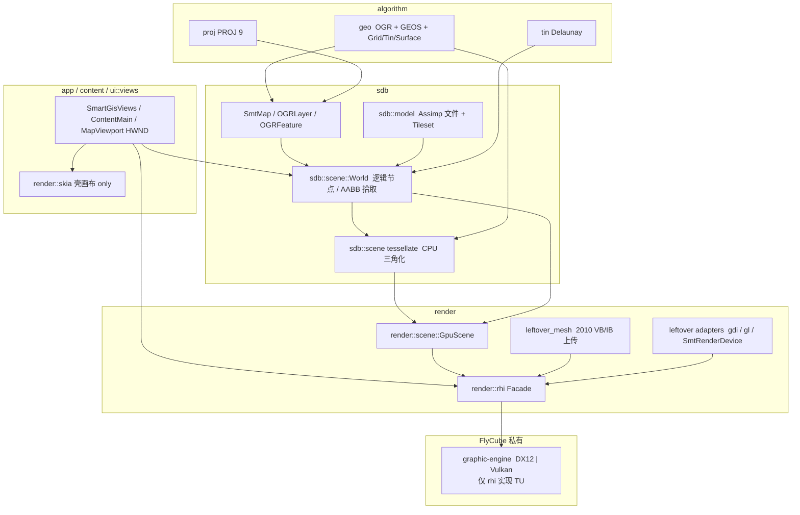
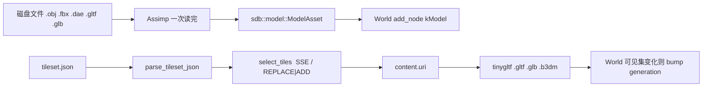

<!--
Copyright (c) 2026 The Mogu Authors.
All rights reserved.
-->

# 模型 / 渲染 / 计算深度设计（OSS 优先）

**Status:** accepted  
**Date:** 2026-09-13  
**Scope:** 伞状深度设计。把 leftover `src/render/*` 映射到目标三层：**模型（CPU 资产 + 逻辑场景）**、**渲染（RHI + GpuScene）**、**计算（algorithm + 可选 GPU compute）**。实现细节仍以两份已有 living spec 为准，本文不重开已锁定决策，也不改 C++。

**实现契约（勿在本文复制整份 API）：**

| 层 | Living spec | 计划 |
| --- | --- | --- |
| 渲染 + 双场景 + CPU 模型 I/O | [`2026-09-13-render-rhi-scene-design.md`](2026-09-13-render-rhi-scene-design.md) | [`../plans/2026-09-13-render-rhi-scene.md`](../plans/2026-09-13-render-rhi-scene.md) |
| 计算 / 几何核 / 投影 / TIN | [`2026-09-13-algorithm-layer-oss-design.md`](2026-09-13-algorithm-layer-oss-design.md) | [`../plans/2026-09-13-algorithm-layer-oss.md`](../plans/2026-09-13-algorithm-layer-oss.md) |

产品语言：**C++23**（`cc_std = "c++23"` → MSVC `/std:c++23preview`）。算法计划里出现的 “C++20” 只表示 traits 写法的下限已被 C++23 吸收，**不以 C++20 为产品标准**。

---

## 1. 目标

一张图、一条 CommandList、一套几何语义：

1. **模型**：GIS 要素 / 图层 / 地图文档在 `sdb`；独立三维文件与 3D Tiles 在 `sdb::model`；逻辑世界与拾取在 `sdb::scene::World`。
2. **渲染**：GPU 只活在 `render::rhi`（FlyCube DX12/Vulkan）+ `render::scene::GpuScene`。桌面壳的画布是 Views + Skia，**不是** GIS GPU。
3. **计算**：分析走 `algorithm/` + OGR（GEOS/PROJ 来自现有 GDAL 栈）。GPU compute 只在能稳定赢过 CPU 时才开。

成功判据：MFC leftover 仍能 `SmtRenderDevice::Init(HWND)` + `BindRhiPresent`；新路径（`gpu` / Views 地图视口）走 `preferred_gpu_backend()`；公开头不出现 FlyCube / Assimp / tinygltf 类型；没有第二套 Geometry 树、没有 Qt、没有 D3D9 复活。

---

## 2. 已锁定决策（本文不再讨论）

| 主题 | 选择 |
| --- | --- |
| 桌面壳 | Chromium-style Views + Skia（`src/ui/views`、`src/render/skia`）。禁止 Qt |
| GPU | FlyCube（DX12 默认 present，Vulkan 同行）。源码用本机 `C:\Dev\src\open\topic\graphic-engine`，**禁止为了编过而 GitHub fetch**。公开 Facade `render::rhi`，公开头零 FlyCube 类型 |
| Debug CRT | FlyCube Debug 已按 `/MDd` 编进 `out/flycube` |
| 场景 | 双场景：`sdb::scene::World`（逻辑 / 查询）+ `render::scene::GpuScene`（GPU 实例 / 录制） |
| 模型 I/O | 独立文件 Assimp（稍后 pin）；3D Tiles 显式 `tileset.json` + tinygltf 解 glTF/b3dm。**glTF ≠ 3D Tiles** |
| 几何 | 一套 OGC 几何（OGR 实例 `coordinateDimension` 2\|3）。禁止 `Geometry2` / `Geometry3` |
| GEOS / PROJ | 只走现有 `//third_party:gdal`（gdal_sdk 运行时），禁止第二份 vendor |
| leftover 缝 | `SmtRenderDevice::Init(HWND)` + `BindRhiPresent` 必须继续能编 |
| 同步 | 新树用 `<mutex>` / `std::mutex`。本仓没有 mogu `base::mutex` |
| 实现所有权 | `src/render` C++（RHI / GpuScene / leftover_mesh）由另一 agent 维护。本文只设计 |

---

## 3. 方案比较（为何选现在这套）

### 3.1 模型与场景图

| 方案 | 要点 | 结论 |
| --- | --- | --- |
| **A. `sdb::model` + `sdb::scene::World` + 双场景（推荐）** | CPU 资产与 GIS 查询离开 `render/`；GPU 只同步 generation | **采用。** 与已落地头文件一致，查询与绘制解耦 |
| B. Cesium Native 一锅端 | 瓦片 / 地形 / 相机全包 | 拒绝：体量大、许可与依赖失控、公开类型会泄漏 |
| C. OpenSceneGraph 当场景+加载器 | 现成 scene graph | 拒绝：绑定旧 GL，第二套场景语义 |
| D. 继续在 `legacy/render/model3d` + `legacy/render/scene3d` 长逻辑图 | 2010 `SmtScene` 八叉树 | 拒绝：render 上翻依赖、无法做 GIS 查询与 GPU 分家 |

### 3.2 渲染后端

| 方案 | 要点 | 结论 |
| --- | --- | --- |
| **A. FlyCube 本地树 + `render::rhi`（推荐）** | DX12/Vulkan，本机 graphic-engine，公开 Facade | **采用。** Debug `/MDd` 已在 `out/flycube` |
| B. Diligent / bgfx / 自研 D3D12 | 另一套完整引擎 | 拒绝：重复抽象、公开类型难收 |
| C. 继续扩 leftover GDI / GL / D3D9 | 现有 DLL 能画 | 拒绝：D3D9 已死；GDI 不是 GIS GPU；GL immediate 不是终局 |

### 3.3 计算

| 方案 | 要点 | 结论 |
| --- | --- | --- |
| **A. `algorithm/` + traits，CPU 默认，GPU 例外（推荐）** | GEOS/PROJ/GDAL raster；FlyCube compute 只打证明过的热点 | **采用。** 拓扑稳健性在 CPU |
| B. 再 vendor 一份 GEOS / CGAL / Triangle | “算法更强” | 拒绝：许可（Triangle）、第二核、与 OGR 重复 |
| C. GIS 算法 GPU-first | buffer / overlay 上 compute | 拒绝：鲁棒性、小数据启动成本、调试面 |

---

## 4. 分层与依赖方向

**依赖只准向下、禁止回指：**

| From | May depend on | Must not depend on |
| --- | --- | --- |
| `app` / `content` / `ui::views` | `sdb`、`render::rhi`、`render::scene`、`render::skia` | FlyCube 头、Assimp/tinygltf 头 |
| `sdb` | `algorithm/geo`、`algorithm/proj`、GDAL/OGR | `render/rhi`、`render/scene`、FlyCube |
| `render::scene` | `sdb/scene`、`render/rhi` | `sdb` 回写、FlyCube 头 |
| `render::rhi` 公开头 | 无第三方 GPU 类型 | FlyCube / D3D12 / Vulkan 头 |
| `render::rhi` 实现 TU | FlyCube（本地 graphic-engine） | `sdb`、`algorithm` |
| `algorithm` | `//third_party:gdal`（`geos_c` / `proj.h`） | `render`、`app`、FlyCube |
| leftover `gdi`/`gl`/`render3d` | 现有 `Smt_*` + 可选 `BindRhiPresent` | 新逻辑场景、新模型加载器 |

`src/render/math`（Eigen Vector/Matrix/Aabb）是**场景数学**，不是第二套几何核。`algorithm/geo` 不再拥有自制 Vector。

---

## 5. 层 1 — 模型（CPU 资产 / 场景图 / GIS 要素）

### 5.1 谁拥有什么

| 数据 | 目标位置 | leftover 现状 | 迁移策略 |
| --- | --- | --- | --- |
| 矢量 / 栅格要素、图层、地图文档 | `sdb/{feature,layer,map}` + GDAL Dataset/Layer | 已在 sdb | 保持。World `attach_map` 只挂一层一个节点，不拷要素 |
| 独立三维文件（OBJ/FBX/DAE/glTF/GLB） | `sdb::model::load_file` → `ModelAsset` | `legacy/render/model3d`（`Smt3DMdLib`：cube/sphere/water/…） | 新加载走 Assimp。leftover 图元 DLL 继续给 2010 视图，**不再加格式** |
| 3D Tiles | `sdb::model::Tileset` + `select_tiles` | 无 | 显式 `tileset.json` 1.0/1.1。内容 glTF/GLB/b3dm 经 tinygltf。不是 Assimp |
| 逻辑场景 / 拾取 / 图层顺序 | `sdb::scene::World` | `legacy/render/scene3d`（`SmtScene` + 八叉树） | 新查询走 World 线性 AABB（节点多了再 pin libspatialindex）。不移植 2010 八叉树 |
| TIN / Grid / 曲面容器 | `algorithm/geo`（`SmtTin` / `SmtGrid` / `Smt3DSurface`） | 同左 + leftover 地形引擎 | World `attach_tin` / `attach_grid`；绘制前 CPU tessellate |
| 地形引擎（相机贴地、分页） | 远期 `NodeKind::kTerrain` + GpuScene | `legacy/render/terrain`（`Smt3DTerrain`） | v1 当 name handle；网格数据走 Tin/Grid。Quantized-Mesh / Cesium 地形 **不做** |
| 点云 | 远期 `NodeKind::kPointCloud` | `legacy/render/pointcloud` | v1 同 handle。LAS/LAZ（PDAL）是后续 pin，不是假装 glTF |

CPU tessellation（`sdb::scene` 的 `tessellate_*`）**属于模型侧**：产出 xyz + index，不含 `render::rhi` 类型。GpuScene 只负责 upload / bind / draw。

### 5.2 Assimp 文件加载 vs 3D Tiles 流式

不要混成一条 “模型加载器”。

| | Assimp `load_file` | 3D Tiles `select_tiles` |
| --- | --- | --- |
| 输入 | 单个文件路径 | `tileset.json` + `ViewState` |
| 语义 | 整模进内存 | 按 SSE 选瓦片，流式 |
| 内容解码 | Assimp 场景 | tinygltf（b3dm 先跳 28 字节头） |
| 失败 | 返回 false，不抛 | JSON 失败不返回半棵树；无 tinygltf 时仍可选瓦，`decode_content` 为 false |
| v1 不做 | 嵌入式 3D Tiles、Draco | implicit tiling、i3dm、pnts、cmpt、Draco |

**禁止：** 把 `.gltf` 目录当成 tileset；用 Assimp 解 b3dm；在 `legacy/render/model3d` 再写一套加载器。

Assimp 未链接时：`load_file` 除内建 `"cube"`（`load_unit_cube`）外一律 false。这是已落地行为，保持。

### 5.3 双场景契约

| | `sdb::scene::World` | `render::scene::GpuScene` |
| --- | --- | --- |
| 进程直觉 | 浏览器 / 内容侧也可持有（逻辑） | GPU 进程录制 |
| 拥有 | 节点 id、kind、AABB、非拥有 GIS 指针 | 同步后的实例 + GPU Buffer |
| 同步键 | `generation_`，可变则 +1 | `synced_generation_`；不等才 `sync_from` |
| 查询 | `query_aabb` = identify / 空间过滤 | v1 不拾取 |
| 绘制 | 不录 CommandList | `record`：先 tessellate 再 **同一 list** 上 2D pass + 3D pass |

瓦片可见集变化必须 bump World generation，否则 GpuScene 会睡死。这是双场景最容易漂的点。

### 5.4 meshoptimizer

**v1 不 pin。** 理由：当前网格来自 GIS tessellate 与 unit cube，没有顶点缓存热点证据。若 3D Tiles 上传后 `draw_indexed` 受后变换瓶颈，再在 `sdb::model::detail` 对 index 做 cache/overdraw 优化（MIT）。禁止把它做成第二套网格格式。

---

## 6. 层 2 — 渲染（RHI + 2D GIS + 3D）

### 6.1 一条 CommandList

`GpuScene::record(device, list, w, h)` 在 **一个** `CommandList` 上：

1. `begin_render_pass`
2. 2D：Point / Line / Polygon / Arc / Fan tessellate → `bind_*` → `draw_indexed`（点扩成小菱形/三角，线扩成带状或线段三角，面耳切/扇切）
3. 栅格 / 瓦片：`tessellate_raster_layer` / `tessellate_tile_layer` → 带影像标志的 textured quad（纹理 upload 随 RHI 资源面扩展；v1 可先画包络 quad）
4. 3D：`Smt3DSurface` / OGR 三维、Tin/Grid、`leftover_mesh` VB/IB、未来 terrain/pointcloud
5. `end_render_pass` + `close` → `Device::execute` → `present`

相机矩阵经 `CommandList::bind_camera`：2D GIS 正交、leftover 3D 透视。GDI/GL **不是** 第二条 CommandList 实现；它们走 `SmtRender` 进程级 `leftover_session()`。

### 6.2 FlyCube 边界

- 本机源：`C:\Dev\src\open\topic\graphic-engine`。GN 通过 `third_party/.src/flycube` **junction / 指向该树**，或直接链已编好的 `out/flycube`。`manifest.json` 的 Gitea/GitHub 行只是镜像备案，**实现 agent 不要 GitHub clone 来救编译**。
- 公开：`#include "render/rhi/rhi.h"`。`Device` / `CommandList` / `Buffer` / `Backend`。
- 私有：仅 `flycube_rhi.cc`（及同目录实现 TU）包含 FlyCube。映射：`Device`→FlyCube Device+Swapchain；`CommandList`→FlyCube CommandList；`execute`→`CommandQueue::ExecuteCommandLists`；`present`→`Swapchain::Present`。
- Windows：`kDx12` 默认 present，`kVulkan` 必须能 `create_device`。无适配器时 `initialize()` 为 false，测试 skip 而非 fail。
- `smt_has_flycube` 为 false 时 stub TU 仍进 `src_all`，`initialize()` 失败。

### 6.3 Skia 的位置

`src/render/skia` 只给 **Views 壳**（按钮、树、表、主题）。禁止：

- 用 Skia 画 GIS 矢量 / 地形 / 模型（那是 FlyCube）
- 把 Skia 当 widget 工具箱（那是 `ui::views`）
- 为了 Skia 引入 Qt 或整树 Chromium

地图 HWND 挂在 `MapViewport` 上，由 `render::rhi` present。

### 6.4 leftover → `src/legacy/render/*`（终局仍在 `src/render/`）

物理拆分见 [`2026-09-13-render-legacy-split-design.md`](2026-09-13-render-legacy-split-design.md)。`src/render/` 只留终局；2010 设备与三维引擎在 `src/legacy/render/<module>`。默认不进 `src_all`；可选编 `//src/legacy/render:legacy_render_all`。本轮 **允许** MFC `Init(HWND)` / `BindRhiPresent` 缝暂时断（拆分规格已锁定）。

| 目录 | 2010 角色 | 目标 | 退役条件 |
| --- | --- | --- | --- |
| `render/rhi/` | （新）Facade | **保留并长肉** | — |
| `render/scene/` | （新）GpuScene only | **保留**。不再放 `leftover_*` | — |
| `render/skia/` | 壳画布 stub | **保留**，永不做 GIS GPU | — |
| `render/math/` | Eigen Vector/Matrix/Aabb | **保留**（场景数学） | 不要搬回 `algorithm/geo` |
| `legacy/render/bridge/`（`renderdevice.*` / `renderer.*` / `leftover_*`） | `SmtRenderDevice` / `SmtRenderer` Bridge；`leftover_mesh` / `leftover_record` / `leftover_session` | **适配器**：目标仍是 `Init(HWND)` → `BindRhiPresent`；`leftover_mesh` 是 2010 VB/IB → 同一 Device 的适配缝。**本轮 present 缝可断**；DLL 仍可经 `legacy_render_all` 另编。新代码不在此加 3D API | MFC 地图视图消失 / leftover 3D 改走 GpuScene 后删 |
| `legacy/render/gdi/` | `SmtGdiRenderDevice` | HWND present 适配。`create_device(kGdi)` stub list | 同上 |
| `legacy/render/gdi_simple/` | 简化 GDI 设备 | 同 gdi，不再分叉功能 | 同上 |
| `legacy/render/gl/` | `SmtGLRenderDevice` | HWND / 旧 immediate 适配。`create_device(kGl)` | 3D MFC 视图切到 GpuScene 后删 |
| `d3d/` | D3D9 / D3DX | **已删除** | 禁止复活 |
| `legacy/render/render3d/` | `Smt3DRenderer` 设备/相机/VB/IB | 网格字节经 `legacy/render/bridge` 的 `leftover_mesh` 上传到 RHI；不要在此写 FlyCube | leftover 相机/状态机被 GpuScene 取代后删 |
| `legacy/render/scene3d/` | `SmtScene` + 八叉树 | 逻辑场景 → `sdb::scene::World`。八叉树不移植 | World 覆盖拾取/附着后，3D 视图停用 `SmtScene` 即可删 |
| `legacy/render/model3d/` | 内置 cube/sphere/… | 新资产 → `sdb::model`。内置图元可当测试网格，不扩格式 | Assimp 覆盖演示模型后删 |
| `legacy/render/terrain/` | `Smt3DTerrain` | `NodeKind::kTerrain` + Tin/Grid tessellate | 新地形通路能画 DEM 网格后删 |
| `legacy/render/pointcloud/` | `Smt3DPointCloud` | `NodeKind::kPointCloud` | 有 CPU 点容器 + GpuScene 绘制后删 |

**适配期原则：** leftover DLL `dll_stem` / `Smt_*` ABI 不动；只允许朝 Facade **单向** 靠（present、拷 VB/IB）。禁止在 leftover 目录新增 Assimp、Tiles、FlyCube include。终局 `render` **禁止**依赖 `legacy_render`。

### 6.5 2D GIS 网格

| 输入 | tessellate | GPU |
| --- | --- | --- |
| `OGRPoint` | 小菱形或两三角 | `draw_indexed` |
| `OGRLineString` | 线段带 / 退化三角 | 同上 |
| `OGRPolygon` / Multi | 耳切或 fan（简单环）；复杂环可先 GEOS 再切 | 同上 |
| Arc（折线近似圆弧） | `tessellate_arc` | 同上 |
| Fan | `tessellate_fan` | 同上 |
| `SmtRasterLayer` / `SmtTileLayer` | 包络 quad + `has_image` | textured quad（纹理资源随 RHI 长） |

样式（颜色、线宽、符号）仍是 `SmtBaseLib` / 图层样式的事；RHI v1 先保证 **几何进同一 list**，不要在 Facade 上长一套 Skia 式 Paint。

### 6.6 3D 网格

| 输入 | 路径 |
| --- | --- |
| `Smt3DSurface` / 带 Z 的 OGR | `tessellate_3d_*` → GpuScene mesh |
| `SmtTin` / `SmtGrid` | `tessellate_tin` / `tessellate_grid` |
| 2010 `SmtVertexBuffer` / `SmtIndexBuffer` | `leftover_mesh::upload_leftover_buffers`（VF_XYZ / VF_XYZRHW），**不需要 GL context** |
| `sdb::model::ModelAsset` | 与 `upload_xyz_mesh` 同一布局 |
| 选中的 3D Tile 内容 | tinygltf → CPU xyz/index → 同上 |
| leftover terrain / pointcloud | v1：World handle；真正 VB 仍可走 leftover_mesh |

---

## 7. 层 3 — 计算（algorithm / compute）

### 7.1 CPU 算法放哪

| 问题 | 放哪 | OSS | 不要 |
| --- | --- | --- | --- |
| buffer / overlay / 谓词 | `OGRGeometry`（`Intersects` / `Buffer` / …） | `geos_c`（GDAL 自带） | 自制几何核、第二份 GEOS、空 `geos_backend` 胶水 |
| 投影变换 | `algorithm/proj`（`proj.h`） | PROJ 9 | Gauss/Lambert 手写、`sdb/crs` 里存 `PJ*` |
| Delaunay / 约束三角 | `algorithm/tin` + `tin::tin_backend_traits` | GEOS 符号优先；缺则 header-only CDT（MPL-2.0） | CGAL、Triangle（许可）、第三套自写 TIN |
| DEM / 高程栅格 | `plugin/dem` + GDAL `RasterIO` → 点 → tin | GDAL | `SmtDemCore` DLL（已从 algorithm 移除） |
| 栅格 warp / hillshade / contour | 先 GDAL 算法 API（CPU） | GDAL | 一上来就写 compute shader |
| 统计 / 表达式 | `algorithm/stat` | 已有 ANTLR 运行时 | 图表 widget（在 `ui/chart`） |
| 正交网格 Laplace | `plugin/orthogrid` + Eigen | Eigen（已 pin） | 塞进 `algorithm/geo` |

几何维度：OGR **实例** `coordinateDimension` 2 或 3。compile-time dim 只给 `src/render/math` 的 Vector2/3/4。GEOS 是 XY：调用前丢 Z，结果按输入实例恢复 dim。这不是 3D GEOS 移植。

### 7.2 leftover TIN/Grid/DEM vs GEOS/自研

| 资产 | leftover | 目标 |
| --- | --- | --- |
| `SmtTin` / `SmtGrid` / `Smt3DSurface` | 容器仍在 `algorithm/geo` | **保留容器**；填充走 `tin` 后端，不保留 2010 自写 incremental/divide 源为第三 fallback |
| `legacy/render/terrain` | 引擎 + 贴图/LOD | 数据面 = Grid/Tin；引擎面 = 适配后删 |
| `CreateDelaunayTin_Div` / `_Inc` | 两个导出名 | 两个名字、**一条** `tin_backend_traits` |
| 高程文件 | 旧 BMP 私有解析 | GDAL 任意栅格；XYZ 走 `tin::read_xyz_points` |

### 7.3 FlyCube compute：何时用、何时不用

RHI 已有 `CommandListType::kCompute`。**默认不开。** 上 compute 必须同时满足：数据量使 CPU/GDAL 成为测量过的热点、输出是规则缓冲（影像、占用栅格、粒子），且结果允许近似。

| 用 GPU compute | 不要用 GPU compute |
| --- | --- |
| 大栅格重采样 / hillshade（GDAL 已证慢） | GEOS overlay / buffer / 拓扑 |
| GpuScene 占用 / 粗视锥（实例极多） | PROJ 点变换（批量也先 CPU） |
| 点云滤波 / 高程着色（点数到百万且已在 GPU） | identify / `World::query_aabb` |
| | 小 TIN（插件对话框级点数） |
| | 一次性分析工具（导出 SHP、面积统计） |

Compute shader 源码与 FlyCube 管线留在 `render/rhi` 实现 TU，**算法语义**（“这是 hillshade”）仍由 `algorithm` 或 `plugin/dem` 调用。禁止在 `algorithm/` `#include` FlyCube。

### 7.4 线程

新树：`std::mutex` / `std::lock_guard` / `std::shared_mutex`。World generation 与 GpuScene sync 的跨线程约定：内容线程可变 World；GPU 线程只 `sync_from` 已发布的快照（或持锁拷节点列表）。不要引入 mogu `base::mutex`。leftover `CRITICAL_SECTION` 留在未改写的 2010 TU。

---

## 8. OSS 表

| 库 | 角色 | 许可注意 | 在树状态 |
| --- | --- | --- | --- |
| **FlyCube** | DX12/Vulkan RHI 后端 | MIT | **本机** `C:\Dev\src\open\topic\graphic-engine`；`out/flycube` 已有 `/MDd` Debug。不要 GitHub fetch。`manifest.json` 仅镜像备案 |
| **Assimp** | 独立三维文件 | BSD-3 | `manifest` pin `v5.4.3`，**稍后** `smt_has_assimp`。未到之前 `load_file` 除 cube 外 false |
| **tinygltf** | Tiles 内容 glTF/GLB/b3dm | MIT（含 json.hpp / stb 注意） | `manifest` pin `v2.9.3`，稍后。无库仍可 `select_tiles` |
| **GDAL/OGR** | 矢量/栅格 I/O、产品几何类型 | MIT/X 风格 + 驱动注意 | **已在** `//third_party:gdal` / `.install` |
| **GEOS**（`geos_c`） | 谓词 / overlay / 可选 Delaunay | LGPL。经 **已随 GDAL 分发的 DLL** 动态链接，不静态塞进产品静态库 | **已在** gdal 运行时。禁止第二份 `third_party/geos` 产品链接 |
| **PROJ 9** | 变换 | MIT/X | **已在** 同一 prefix |
| **Eigen** | `render/math`、orthogrid Laplace | MPL-2 | **已 pin**。不是 geo Vector |
| **CDT** | TIN fallback | MPL-2 | **仅当** 随船 `geos_c.h` 缺 Delaunay 符号。`third_party/cdt` |
| **meshoptimizer** | 大瓦片 index 优化 | MIT | **不 pin**，直到有性能证据 |
| **libspatialindex** | World AABB 加速 | MIT | manifest 已有、产品未接。节点多了再说 |
| **Skia** | 壳 canvas | BSD-3 | 不整树 vendor；`render/skia` stub |
| **PDAL** | LAS/LAZ | BSD-3 | **不 pin**（点云 v2） |
| Cesium Native / OSG / Filament / Diligent / bgfx | — | — | **禁止** |
| Qt / Chromium 整树 / D3D9 D3DX | — | — | **禁止** |
| Triangle / CGAL | TIN | Triangle 许可不可接受；CGAL 过重 | **禁止** |

GEOS LGPL：只使用已随 `gdal_sdk` 提供的共享库，产品侧走 `geos_c`。不要把 GEOS 源码编进 `SmtGeoCore` 静态对象。

---

## 9. 数据流（端到端）

1. 打开地图：GDAL/OGR → `SmtMap` → `World::attach_map`（一层一节点）。
2. 打开模型：`load_file` 或 `parse_tileset_json` + `select_tiles` → `add_node(kModel|kTileset)`。
3. 分析：`geo::buffer` / `SmtProjectPoint` / `CreateDelaunayTin_*` 改的是 sdb 数据，然后 bump generation。
4. 相机帧：tileset 可见集变化 → bump → GPU 进程 `GpuScene::sync_from`。
5. `create_command_list` → tessellate（CPU）→ upload → 2D+3D `draw_indexed` → `execute` → `present`。
6. Identify：`World::query_aabb`（CPU）。不要读回 GPU 做 v1 拾取。

错误：跨 DLL 不抛异常。RHI / `load_file` / `parse_tileset_json` 返回 false。GEOS/PROJ/GDAL 失败写现有日志（`SmtLog` / `CPLGetLastErrorMsg` / `proj_context_errno_string`）。

---

## 10. Non-goals

- Qt（Widgets / Quick / QML / Network）以及任何 Qt 发行版。
- 整树 vendor Chromium 或 Skia。
- 复活 D3D9 / D3DX（`src/render/d3d` 已删除）。
- 公开头泄漏 FlyCube / Assimp / tinygltf / D3D12 / Vulkan 类型。
- 把 Skia 当 GIS GPU 或 widget 工具箱。
- `Geometry2` / `Geometry3`，或第二套虚函数几何树。
- 第二份 GEOS / PROJ / GDAL。
- 把 glTF 文件假装成 3D Tiles；v1 implicit tiles / Draco / i3dm / pnts / cmpt。
- 把逻辑场景图写回 `legacy/render/scene3d` / `legacy/render/model3d`。
- 改 leftover `Smt_*` ABI / 合并 DLL。
- mogu `base::mutex`。
- 本文档落地 C++（`src/render` 实现属另一 agent）。

---

## 11. 测试与构建（设计约束，不在本文实现）

沿用两份 living spec 的测试表：`rhi_test`、`model_test`、`scene_test`、`scene_gpu_test`、`unified_draw_test`、`geo_*`、`proj_*`、`tin_*`。一律 `testing/test.gni` + `expect`/`main`，未 fetch googletest 前不引入 gtest。

产物只在仓库根 `out/`。`third_party` CMake **不**跟产品 `cc_std`。

---

## 12. 风险

- FlyCube 本机树与 `out/flycube` `/MDd` 必须和产品 Debug CRT 一致；对不齐就保持 stub，`initialize()` false。
- Assimp FBX 体积大：未 pin 时 cube + false 是绿路径。
- 双场景只认 `generation`：忘 bump = GPU 停更。
- leftover `Smt3DRenderDevice`（GL 矩阵栈）不是 FlyCube 路径；3D MFC 视图在切换前仍走 2010 引擎。
- GEOS XY：Z 只活在产品实例上。
- 删除 `SmtMathLib` 等 DLL 后，外部 `LoadLibrary` 旧名会失败；本仓插件走 GN，不做转发 stub（见算法 spec）。

---

## 13. 推荐默认（不阻塞实现）

下列本可写成 Open questions，直接拍板：

| 项 | 默认 |
| --- | --- |
| FlyCube 如何进 GN | junction/指向 `graphic-engine`，或链 `out/flycube`；禁止 GitHub |
| World 空间索引 | v1 线性 AABB；热了再接已 pin 的 libspatialindex |
| 栅格 textured quad | v1 包络网格 + `has_image`；纹理 upload 随 RHI 资源面 |
| 点云格式 | v1 leftover handle；不 pin PDAL |
| 地形格式 | v1 Tin/Grid + leftover 引擎；不 pin Cesium 地形 |
| meshoptimizer / Draco | 不 pin |
| GPU compute 第一刀 | 没有测量过的栅格热点就不上 |
| 3D 拾取 | v1 只用 World AABB |

---

## 14. 文档与所有权

| 文档 | 角色 |
| --- | --- |
| **本文** | 三层深度 + leftover 映射 + OSS 总表 |
| `2026-09-13-render-rhi-scene-design.md` | RHI / 双场景 / 模型 API 的实现契约 |
| `2026-09-13-algorithm-layer-oss-design.md` | geo/proj/tin/dem/chart 实现契约 |
| `docs/build/src-layout.md` | 目录分层 as-built |
| `docs/build/ui-views-skia.md` | 壳终局 |
| `docs/build/mogu-mapping.md` | 工程管理对照 |

C++ 实现分区：`src/render`（含 rhi/scene/leftover_mesh）另一 agent；`algorithm/*` 按算法 spec 的 package agent；本文作者只改 `docs/`。
