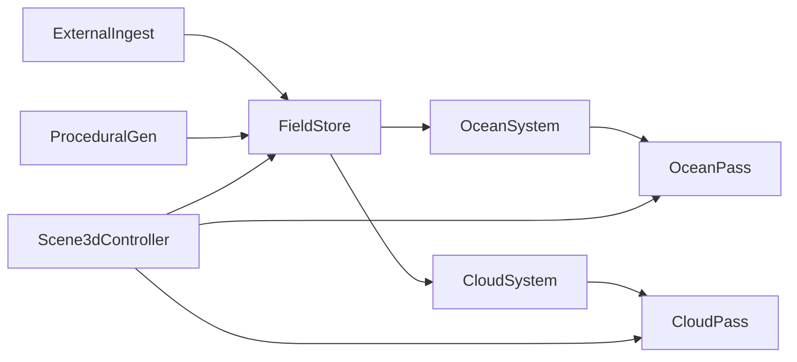

<!--
Copyright (c) 2026 The Mogu Authors.
All rights reserved.
-->

# 大气环境层：海洋 + 云层（方案 1）

**Status:** accepted  
**Date:** 2026-09-19  
**Scope:** 在 Views 新栈（`gis::World` + `render::scene::GpuScene` + `Scene3dController`）上落地大气旁路：双通道 `FieldStore`、GPU FFT 海洋、体积云；External / Procedural 对等；**不接** leftover `scene3d` / `SmtScene`。  
**Related:** RHI 双场景 [`2026-09-13-render-rhi-scene-design.md`](2026-09-13-render-rhi-scene-design.md)；World / GpuScene [`2026-09-19-scene3d-world-gpuscene-design.md`](2026-09-19-scene3d-world-gpuscene-design.md)；岸线掩膜 [`../../src/gis/world/land_mask.h`](../../src/gis/world/land_mask.h)。  
**Plan:** [`../plans/2026-09-19-atmosphere-ocean-cloud.md`](../plans/2026-09-19-atmosphere-ocean-cloud.md)

## Goal

1. 提供会话级 **`gis::atmosphere::Environment`**（时间轴、太阳、开关），旁挂在 `MapScene` / `Scene3dController`，**不进** `gis::NodeKind`。  
2. **`FieldStore`** 作为唯一共享场平面：External（GDAL NetCDF/GRIB/GeoTIFF）与 Procedural 按 priority + `valid_mask` 混合；无文件时 Procedural 底图可跑。  
3. **`render::atmosphere`** 提供海面 FFT/位移、云 raymarch、场纹理上传；只依赖 `render::rhi`（经 `atmosphere_sources` → render DLL），不新建 Device。  
4. 绘制顺序：天空 → 海面 → 陆地/模型（现有）→ 体积云 → 可选后处理；岸线海=非陆（复用 `land_mask` / `kSeaMask`）。

## Non-goals

- 不 vendor 第二套大气/海洋引擎；不做完整 GCM。  
- 不接 leftover `SmtScene` / `scene3d` 绘制路径；Views **不得** `#include "legacy/…"`。  
- Skia **不做** 3D 大气（Skia 仅壳画布）。  
- 禁止 Qt；不复活 D3D9。  
- v1 不做完整多次散射；浅水方程步进接口可预留但不实现。

---

## §1 架构

### 分层

| 层 | 命名空间 / 路径 | 职责 |
| --- | --- | --- |
| 逻辑场 | `gis::atmosphere` → `src/gis/atmosphere/` | `Environment`、`FieldStore`、ingest、procedural、`OceanSystem`、`CloudSystem` |
| GPU pass | `render::atmosphere` → `src/render/atmosphere/` | `FieldTexture`、`OceanPass`、`CloudPass` |
| 宿主 | `src/app/views/` | `Scene3dController` 可选挂载 Environment；默认关，自测/demo 开 |

### 数据流

### 锁定决策

| Topic | Choice |
| --- | --- |
| 宿主 | Views 新栈 only；与 `Scene3dController` 同一 lon/lat 与相机矩阵 |
| 场模型 | 双通道对等；混合规则 = priority 高者覆盖 + `valid_mask` |
| 海洋 | v1 GPU FFT 波谱（Phillips/JONSWAP 简化）；可降级 Gerstner；接口仍称 FFT 路径 |
| 云 | 视锥 raymarch；单次散射 + 啤酒定律；质量档在 `AtmosphereParams` |
| 插入点 | `GpuScene::record_draws` 前后（或显式回调）插入 atmosphere passes；不新建 Device |
| ABI | 新 API `snake_case`；公开命名空间两层 `gis::atmosphere` / `render::atmosphere` |

### 目录与 GN

| 路径 | 内容 |
| --- | --- |
| `src/gis/atmosphere/` | `environment`、`field_*`、`ocean_system`、`cloud_system`、`BUILD.gn` + `*_test.cc` |
| `src/render/atmosphere/` | `ocean_pass`、`cloud_pass`、`field_texture`、`BUILD.gn` |
| 接线 | `src/gis/BUILD.gn` deps `atmosphere_sources`；`src/render/BUILD.gn` deps `atmosphere_sources`（deps `rhi_sources`，避免 cycle） |

---

## §2 场模型（FieldStore）

### 通道 `FieldChannel`

| 枚举 | 语义 |
| --- | --- |
| `kWindU` / `kWindV` | 水平风分量 |
| `kWaveHs` | 有效波高 |
| `kWaveDir` | 波向 |
| `kCloudCover` | 云量 [0,1] |
| `kCloudBase` / `kCloudTop` | 云底/云顶高度 |
| `kSeaMask` | 海面掩膜（1=海）；可由 `land_mask` 派生（海=非陆） |

### 网格与采样

- **`FieldGrid`**：lon/lat 矩形规则网（`min_lon/lat`、`max_lon/lat`、`cols`、`rows`）。  
- **时间**：线性插值；空间越界 **clamp**。  
- **`FieldLayer`**：单通道一层；带 `FieldSourceKind`（`kExternal` / `kProcedural`）、`priority`、`valid_mask`、可选时间片。  
- **`FieldStore`**：按通道聚合多层；公开缝：`set_layer` / `upload_slice` / `sample` / `timed_slice_range`。  
- **External ingest**：`ingest_gdal_field`（单文件）与 `ingest_gdal_field_series`（路径列表 + `time_sec` 列表）。  
- **`Environment` 时间轴**：`load_external_series`、`timed_field_range`、`scrub_time_sec` / `advance_time_sec` / `clamp_time_to_field`（会话时钟）。  
- **Procedural 底图**：保证无 External 文件时 demo / 单测可跑。  
- **External**：GDAL 路径；无 GRIB/NetCDF 驱动时以 GeoTIFF / 规则栅格为准，不自研解码器。  
- **预留**：`ProceduralStep` 浅水步进接口，首版可不实现。

---

## §3 海洋

### 逻辑（`OceanSystem`）

- 读 `FieldStore`：`kWaveHs`、`kWaveDir`、`kWindU/V`、`kSeaMask`。  
- 输出瓦片级海面参数（Hs、向、海掩膜），供 `OceanPass` 上传。

### GPU（`OceanPass`）

- 可平铺位移网格；v1 **GPU FFT 波谱**：默认 **方向性 JONSWAP-lite**（风驱动峰频 + γ 峰增强），`use_jonswap=false` 时回退 **Phillips**；CPU 侧按离散谱能量归一化使 σ≈Hs/4（encode `height_scale≈0.55·Hs`）。  
- 流程：`ComputePipelineId` 频谱（写 height spectrum + seed）→ bit-reverse → radix-2 → height encode(R)；再从 seed 做 Tessendorf `Dx/Dz = IFFT(-i·chop·k̂·ĥ)` → encode(G/B)。Ocean VS 采样 RGBA 施加高度与 chop。  
- 回退：Null RHI / `quality==0` / Gerstner / `prefer_gpu_fft=false` → CPU FFT（同 JONSWAP+位移）或 Gerstner 后上传 height。  
- 岸线：`kSeaMask` discard / 深度测试。  
- 着色：菲涅尔 + 深浅水色；法线由位移后世界坐标屏导数得到。  
- 风险默认：FFT 复杂度过高时可降分辨率或 Gerstner；**接口仍叫 FFT 路径**。

---

## §4 云层

### 逻辑（`CloudSystem`）

- 读 `kCloudCover` / `kCloudBase` / `kCloudTop` / 风；可选噪声平流写回 cover。

### GPU（`CloudPass`）

- 视锥内 raymarch（3D 噪声 + cover 纹理调制）。  
- 太阳方向来自 `Environment` / `AtmosphereParams`。  
- 质量档（步数）在 `AtmosphereParams`。  
- v1：**不做**完整多次散射；单次散射 + 啤酒定律即可。

---

## §5 接缝 / 测试 / 非目标复核

### 接缝

- `GpuScene::record_draws` 前后插入 `OceanPass` / `CloudPass`；共享同一 `rhi::Device` / `CommandList`。  
- **合成 / load-op**：`render::rhi::ColorLoadOp`（`kClear` / `kLoad`）。海洋首个 `begin_render_pass` 用 `kClear`；陆地与云用 `kLoad`。FlyCube 将每个 facade `begin`/`end` **顺序执行**为独立 GPU `BeginRenderPass`/`EndRenderPass`（真多 pass）。  
- **深度**：`RenderPassDesc::enable_depth` + `DepthLoadOp`；共享 D32 depth RT。海洋/陆地 `DepthMode::kWrite`；云 `kTestOnly` + alpha blend。  
- **着色器**：`PipelineId::{kOcean,kCloud}`（HLSL via FlyCube `CompileShader`）；海洋 = GPU FFT compute（JONSWAP/Phillips 频谱 + bit-reverse + radix-2 + Tessendorf Dx/Dz → RGBA8，R=h / G=Dx / B=Dz）或 CPU FFT/Gerstner 回退 + VS 位移 + PS Fresnel；云 = 甲板网格 + PS 短程 raymarch，`BlendMode::kSrcAlpha`。  
- **GPU FFT compute**：`ComputePipelineId::{kOceanSpectrum,kOceanFftBitReverse,kOceanFftButterfly,kOceanDisplacementSpectrum,kOceanHeightEncode}`；FlyCube `CreateComputePipeline` / `Dispatch`；能量归一化在 CPU 计算 `amp_scale`（σ=Hs/4）；Null / `quality==0` / Gerstner / `prefer_gpu_fft=false` 走 CPU。真机可选 `SMT_RUN_FLYCUBE_GPU=1`。  
- `Environment` 挂在 Views 会话；默认大气关；`--self-test` 在 FlyCube present 前调用 `enable_atmosphere_demo()`。  
- 与 `Scene3dController` 同一 lon/lat 范围与相机矩阵（`set_view_camera`）。

### Honest limits (remaining)

- 无 GPU reduction / readback：幅度靠解析谱能量归一化，非逐帧 max|h| 标定。  
- JONSWAP 为方向性 lite（cos² 展布 + 固定 α/γ）；非完整多峰/浅水谱。  
- RGBA8 位移量化仍有编码噪声；未做 Stockham / 更高阶滤波。

### 测试

| 目标 | 断言 |
| --- | --- |
| `FieldStore` | 混合 / 插值 / clamp |
| `SeaMaskFromLand` | 海=非陆，与 `land_mask` 一致 |
| ocean / cloud | 参数纯函数可单测 |
| Null RHI | `OceanPass` / `CloudPass` record 不崩 |

### 非目标（再声明）

不 vendor 第二引擎；不接 `SmtScene`；不做完整 GCM；Skia 不做 3D 大气。

### 成功标准

1. Living design（本文）Status `accepted`，含 §1–§5。  
2. 公开 API 脚手架冻结：`FieldChannel` / `FieldStore` / `AtmosphereParams` / `Environment` / pass 头文件可编译进 gis / render DLL。  
3. 后续并行车道（Field / Ocean / Cloud / wire-views）可对脚手架编译，互不阻塞实现细节。  
4. 默认开关关；相关单测与 Null RHI 冒烟在后续任务变绿。

### Out of scope for later

- 完整 External NetCDF/GRIB 驱动矩阵与业务气象产品。  
- 多次散射、完整浅水步进、交互式天气编辑 UI。  
- leftover scene3d 大气迁移（明确不做）。
