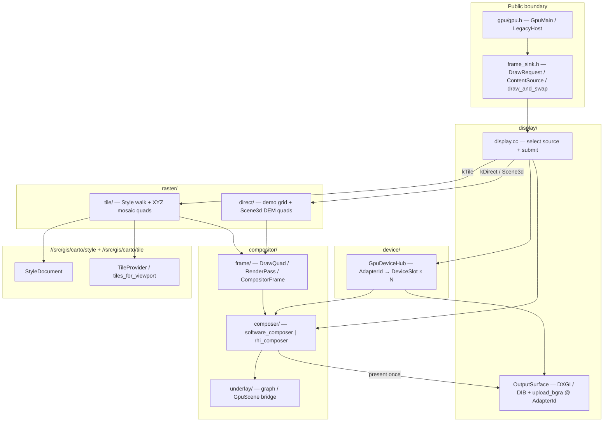
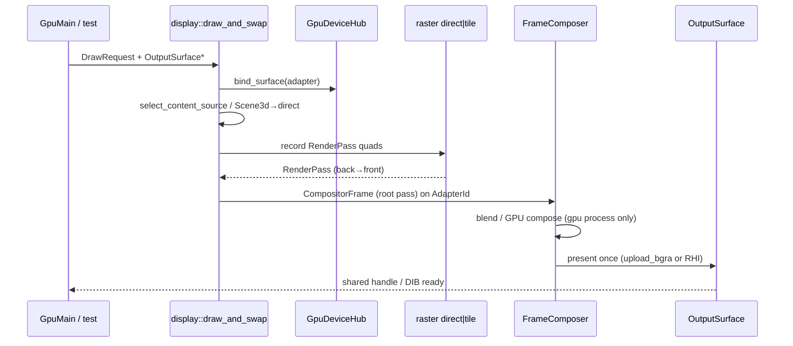
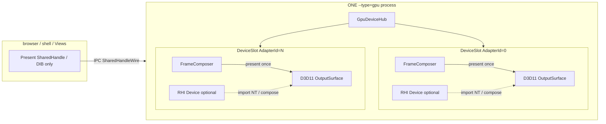
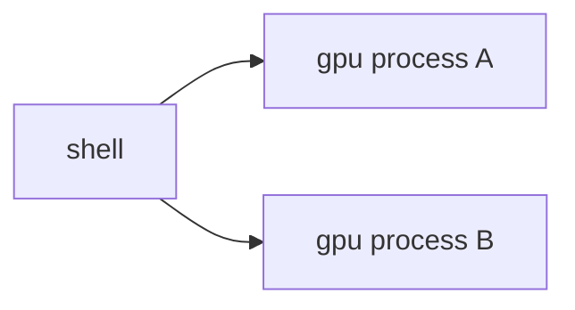
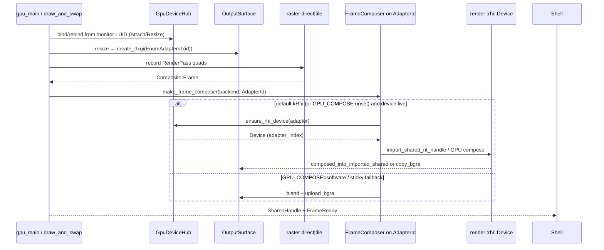

<!--
Copyright (c) 2026 The Mogu Authors.
All rights reserved.
-->

# `src/gpu`

**Diagram:** [`docs/superpowers/diagrams/render-accelerate-topology.html`](../../docs/superpowers/diagrams/render-accelerate-topology.html)（A×B 整合） · Living §GPU-process in [`docs/superpowers/specs/2026-09-13-render-rhi-scene-design.md`](../../docs/superpowers/specs/2026-09-13-render-rhi-scene-design.md)

`--type=gpu` payload. Shell talks only to `content/public`; this tree owns paint
**and final compose**. MapLibre Native is **not** in this tree (pin removed;
reconsider later). Browser / renderer / shell must **not** blend map layers into
the final frame.

## Core principles

1. **One draw entry.** Process and tests paint only through `draw_and_swap`
   (`frame_sink.h`). Callers never include `compositor/` or `raster/` headers.
2. **Record then present — compose only here.** Raster TUs append `DrawQuad`s
   into a `RenderPass`; display wraps that into one `CompositorFrame`; a
   `FrameComposer` (default **RHI**; `GPU_COMPOSE=software` escape) blends
   the root pass and presents onto `OutputSurface` **once** per frame. Software
   compose is a **per-adapter** sticky fallback inside this process, never in
   shell.
3. **Multi-adapter hub.** `GpuDeviceHub` pins each `OutputSurface` to an
   `AdapterId` (default `kAdapterPrimary`). One GPU process drives N device
   slots; present is per-output.
4. **Two content sources, not three.** **Direct** (default): demo grid for 2D,
   Scene3d DEM underlay in the same call (returns true — not a third mode).
   **Tile**: Style JSON + XYZ via `gis::style` / `gis::tile`. Selection:
   `set_content_source` > `MAP_BACKEND=a|track_a|maplibre` >
   command `view.backend.maplibre` / `view.backend.rhi`.
5. **Compositor is display IR + compose, not a second engine.** Split under
   `compositor/`: `frame/` (IR), `composer/` (`FrameComposer` + software/rhi),
   `underlay/` (graph/scene bridge). Does not own fetch, Style walk, or DXGI.
6. **Surface is pixels only.** `OutputSurface` owns DXGI shared texture or DIB
   on a pinned adapter; demo drawing is not an `OutputSurface` method.

If tile cannot draw because the surface is null or its size is 0, the same call
clears the direct color when a surface exists.

Process entry stays `gpu/gpu.h`.

### Leftover GDI → compose IR (as-built)

`legacy_render` map buffers (`SmtRenderBuf`) compose in-process via
`//src/gpu:compositor_cpu_blend`. On publish, optional `Rhi2dSetBgraSubmit`
hands BGRA to the GPU process. `gpu_main` binds that sink to
`make_frame_composer` → `draw_frame` on the active `OutputSurface` (NN-scale
when sizes differ). Shell never final-blends.

## Architecture



### Frame pipeline (one present)



| Directory | Role |
| --- | --- |
| `frame_sink.h` | `DrawRequest`, `ContentSource`, `draw_and_swap` |
| `device/` | `AdapterId`, `GpuDeviceHub` (multi-adapter slots + RHI devices) |
| `display/` | Choose content; submit one `CompositorFrame`; `OutputSurface` |
| `compositor/frame/` | IR: `DrawQuad` / `RenderPass` / `CompositorFrame` (`frame.h`) |
| `compositor/composer/` | `FrameComposer` + `software_composer` / `rhi_composer` |
| `compositor/underlay/` | Frame Graph / GpuScene underlay bridge |
| `raster/tile/` | Style walk records quads; decode, mosaic, fetch |
| `raster/direct/` | GDI demo bitmap and DEM mesh record quads |

Layout note: as-built in this README; historical layout design in
[`docs/superpowers/archive/specs/2026-09-27-gpu-subdirectory-layout-design.md`](../../docs/superpowers/archive/specs/2026-09-27-gpu-subdirectory-layout-design.md).

Wire names `MAP_BACKEND=…maplibre` and `view.backend.maplibre` still select
`ContentSource::kTile` (StyleDocument + TileProvider). They do **not** mean
MapLibre Native is linked. Native pin / `enable_maplibre` / `maplibre_link`
were **removed** (2026-09-27); see archived
[`docs/superpowers/archive/specs/2026-09-27-maplibre-out-of-gpu-design.md`](../../docs/superpowers/archive/specs/2026-09-27-maplibre-out-of-gpu-design.md).

## Multi-GPU (as-built)

**Model:** one `--type=gpu` process × **N** adapter device slots. Not N gpu
processes. Shell / browser never compose; they consume NT shared handles /
DIB from this process only. **No** single-frame multi-GPU split.

**Default compose:** `ComposeBackend::kRhi` when `GPU_COMPOSE` is unset /
empty / unknown. Escape hatch: `GPU_COMPOSE=software` (case-insensitive).
Hard RHI failure → sticky **software** for **that adapter only**.

**Monitor affinity:** `AttachSurfaceBody` / `ResizeSurfaceBody` carry
`monitor_luid_low` / `monitor_luid_high` (and optional `adapter_hint`,
`0xffffffff` = unset). Shell resolves LUID from a local `HMONITOR` — **`HMONITOR`
is not sent over IPC**. `gpu_main` binds / **rebinds** the surface via
`GpuDeviceHub` (not forever primary-only).

| Concept | Role |
| --- | --- |
| `AdapterId` | DXGI `EnumAdapters1` index (`kAdapterPrimary = 0`) |
| `GpuDeviceHub` | Process-wide singleton: slots, surface pin map, RHI devices, texture cache, underlay Effects |
| `OutputSurface` | DXGI shared texture or DIB; `adapter_id_` pin; `create_dxgi` opens that adapter |
| `FrameComposer` | One instance per draw on one `AdapterId` (default `RhiComposer`; `SoftwareComposer` escape / sticky) |
| `prefer_adapter_for_monitor` / `rebind_surface_to_monitor` | LUID / DXGI output affinity; **`gpu_main` rebinds** on Attach/Resize from monitor LUID |
| `notify_device_lost` | Drop RHI + cache, sticky software, bump surface generation (tests / recovery hook) |

### Process topology



**Not the model:**



### Per-frame path (multi-adapter)



### Capability boundary

| Item | Status |
| --- | --- |
| `CompositorFrame` IR | **As-built** |
| Compose only in `--type=gpu` (not shell) | **As-built** (normative) |
| `FrameComposer` seam + `SoftwareComposer` | **As-built** |
| Default compose `kRhi`; `GPU_COMPOSE=software` escape | **Normative (A+C)** |
| Sticky per-adapter software fallback | **As-built** |
| `GpuDeviceHub` + `AdapterId` pin | **As-built** |
| DXGI enumerate + `D3D11CreateDevice` on pin | **As-built** |
| Per-adapter `ensure_rhi_device` (`adapter_index`) | **As-built** (Dx12 preferred; Null / sticky software fallback) |
| FlyCube `import_shared_nt_handle` / compose-into-shared | **As-built** when `HAS_FLYCUBE` + DXGI shared (`READ\|WRITE` NT) |
| `copy_bgra_to_imported_shared` | **As-built** (CPU blend → GPU copy when compose-direct fails) |
| GPU compose `kSolid` / `kBgra` / `replaces` | **As-built**; import path sets `composed_into_imported_shared` |
| Per-adapter texture cache | **As-built** |
| Frame Graph / GpuScene underlay bridge | **As-built** (record only) |
| `notify_device_lost` / generation bump | **As-built** (API + tests; auto-TDR from OS = P2) |
| Monitor LUID on Attach/Resize; `gpu_main` rebind | **Normative (A+C P1)** — hub APIs ready; IPC LUID fields + rebind path |
| Headless / DIB-only | `upload_bgra` only (no NT import) |
| Cross-adapter D3D11↔DX12 (mismatched LUID) | **Best-effort** — `OpenSharedHandle` may fail |

`view.backend.rhi` only selects `ContentSource::kDirect`, not FlyCube.
`//src/gpu:gpu_backend` deps `//src/render:rhi` (+ graph/scene) for RHI compose.

- Spec: [`docs/superpowers/specs/2026-09-13-render-rhi-scene-design.md`](../../docs/superpowers/specs/2026-09-13-render-rhi-scene-design.md) §GPU-process accelerate（Topology B；与 in-process L0–L3 双拓扑）
- Diagram: [`docs/superpowers/diagrams/render-accelerate-topology.html`](../../docs/superpowers/diagrams/render-accelerate-topology.html)（A×B 整合 · §4–§6）
- Archive: [`docs/superpowers/archive/specs/2026-09-27-gpu-rhi-accelerate-design.md`](../../docs/superpowers/archive/specs/2026-09-27-gpu-rhi-accelerate-design.md)
- Plan (sole checklist): [`docs/superpowers/plans/2026-09-27-gpu-rhi-accelerate.md`](../../docs/superpowers/plans/2026-09-27-gpu-rhi-accelerate.md)

## Tile frames

1. Parse Style JSON with `gis::style::StyleDocument` (`//src/gis/carto/style`).
2. Parse Style `sources` with `gis::tile::parse_style_sources` → `SourceRegistry`
   / `TileProvider` (`//src/gis/carto/tile`); raster `layer.source` must match a
   source id (missing id → skip that layer).
3. Walk `layers` in order into a `RenderPass` (back to front), then one present:
   - `background`: `background-color` + `background-opacity`
   - `raster`: fetch via `TileFetchFn` (injected into TileProvider) +
     `raster-opacity` (src-over)
4. **Viewport XYZ mosaic**: when `DrawRequest.extent` is valid
   (`xmax > xmin` and `ymax > ymin`), call `gis::tile::tiles_for_viewport`
   (zoom from `DrawRequest.zoom`, or `estimate_zoom` when `zoom < 0`).
   Each visible tile is fetched and blitted by its Web Mercator world rect into
   the present size. Degenerate / empty extent keeps the legacy single tile
   `z/x/y = 0/0/0` stretched to the full surface (old tests stay green).
5. XYZ templates: Style source `tiles[]` wins when `layer.source` is set;
   otherwise `tile_url_templates` (one per unbound raster layer in order), or
   legacy single `tile_url_template`. If the style has no `raster` layers but
   request templates are set, each template is composited as an opaque raster
   pass (keeps `XYZ_URL` / callers working).
6. No network / no `fetch`: background-only frames still succeed.

`DrawRequest::fetch` is the TileProvider hook at the call site — do not add a
second HTTP cache inside gpu. `--type=gpu` (`gpu_main`) injects
`make_net_tile_fetch()` (wraps `net::HttpClient::get`, same stack as
`TileProvider` default) when `XYZ_URL` / `tile_url_templates` or Style
`sources` are present. Fetch failures return `ok=false`; paint keeps background.

### Hand-test real XYZ over `--type=gpu`

```bat
set MAP_BACKEND=a
set XYZ_URL=https://tile.openstreetmap.org/{z}/{x}/{y}.png
REM launch shell / views host that spawns --type=gpu as usual
```

Expect: basemap paint draws the background, then composites the **viewport XYZ set**
(from the surface extent via `tiles_for_viewport`) over HTTP(S). Before the
host sets a non-degenerate extent, basemap paint uses a single
`z/x/y = 0/0/0` tile. Unset `XYZ_URL` → background only, process stays up.
Bad template or offline → same background fallback (no crash).

## Tests

```bat
build.bat render_backend_test.exe
out\render_backend_test.exe
```

Covers content-source selection (`set_content_source` beats the environment),
default direct demo clear, Scene3d `draw_and_swap` drawing the demo frame
and returning true, `background-opacity`, multi-raster + `raster-opacity`,
Style `sources` + `layer.source` binding (injected `TileFetchFn`, no real HTTP
/ no request templates), viewport XYZ mosaic (non-`0/0/0` fetch + world-rect
blit), degenerate-extent fallback to `0/0/0`, offline background, and
`make_net_tile_fetch` invalid-URL / miss-keeps-background. Basemap pixel
checks select basemap first.
